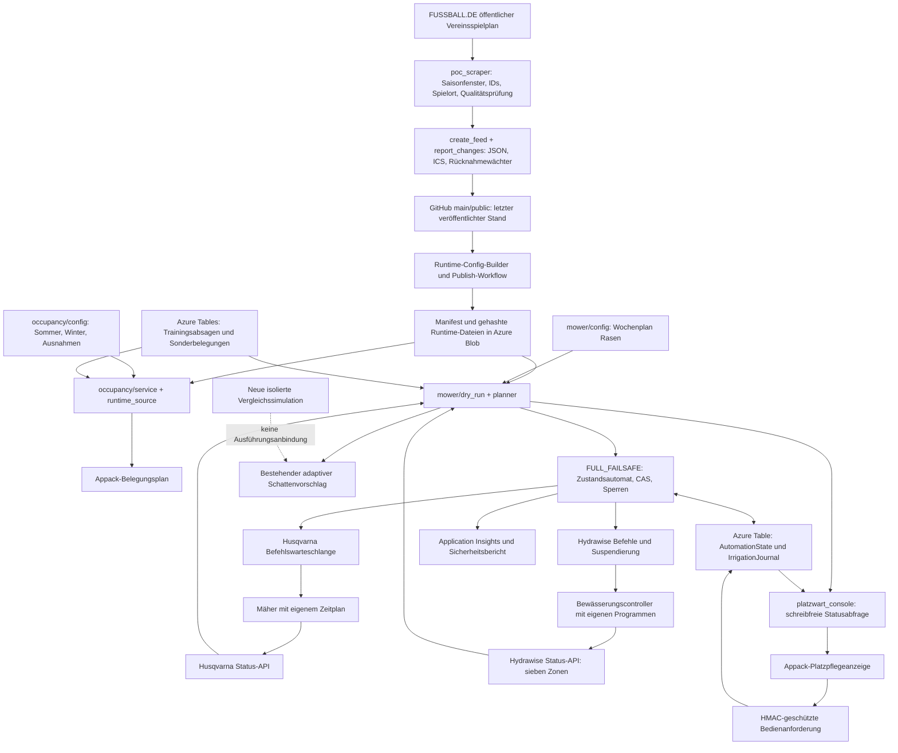

# Tatsächliche Architektur und Prüfdeckung

Stand: lesende Erhebung am 09.09.2026. Ausgangs-SHAs und konkrete Releases stehen
in [versions-and-evidence.md](versions-and-evidence.md). Alle 197 zum Ausgangsstand
getrackten Pfade sind im [Inventar](repository-inventory.txt) aufgeführt. Inventar
bedeutet keine vollständige Zeilenprüfung jedes Dokuments. Die folgende Tabelle
weist die Tiefe aus. Synchrone Projektquellen unter `sources/` wurden nicht geändert.

## Verantwortung, Zeit und Persistenz

| Teil | Tatsächlicher Vertrag und Prüfung | Noch offene Grenze |
|---|---|---|
| Import | Öffentlicher FUSSBALL.DE-Vereinsspielplan per HTML; vier akzeptierte Saisonfenster beim aktuellen Vergleich. Kein DFBnet-Login. Stabile Spiel-/Mannschafts-/Festival-IDs, explizite Verlegungsketten, lokale Sportstätte und Platzentscheidung. Tief geprüft, live lesend verglichen. | Neun Quell-Team-IDs sind keine autorisierte vollständige Mannschaftsmeldeliste. Private/unveröffentlichte DFBnet-Termine bleiben unbekannt. |
| Veröffentlichung | Qualitätsstatus, Rücknahmebestätigung, `public/` JSON/ICS und Quellzeitpunkt. MAIN war bei Importhärtung weiter als der Migrationsbranch; gezielte Integration im Audit. | Atomare Veröffentlichung kann neue Sperren zusammen mit einer wartenden Rücknahme verzögern. Additive Quarantäne ist separat zu entwickeln. |
| Runtime-Konfiguration | Manifest, Dateihashes, Altersgrenzen und Cache. Strengere Sicherheitsgrenze 720 Minuten; Anzeigegrenze 1440 Minuten. Tief geprüft, Format-/Alterstests. | Nach hartem Ablauf ist ohne aktuelle Ersatzpflege kein vollständiger künftiger Spielplan belegt. Ein Cachezeitpunkt darf Quellenalter nicht auffrischen. |
| Training | Sommer-Rasenplan: acht Termine im Mäherplan stimmen mit acht Rasen-Terminen der Sommer-Appkonfiguration überein. App hat insgesamt 17 Sommer- und 18 Wintertermine. Winter: alle 18 auf Kunstrasen; Mäherplan bleibt acht Sommertermine im Jahresbereich 11.08.2026–09.07.2027. Absagen mit stabilen Vorkommens-IDs und verzögerter Freigabe. | Keine verbindlichen Sommer-/Winter-Umschalttage oder vollständige Ferienliste vorhanden. Saisonwahl im Frontend ersetzt keinen zentralen Betriebsentscheid. Keine automatische Winterfreigabe eingeführt. |
| Sonderbelegungen | Azure Tables und statische Einmalereignisse; Fehler der dynamischen Quelle sperren konservativ. Verbindliche Sperren dürfen nicht durch den normalen Belegungs-Override umgangen werden. | Vollständiger Vor-Ort-Sperrkalender und neue manuelle Einträge nicht unabhängig abgenommen. |
| Mähplanung | Rasen-ICS bereits mit 60/60 Minuten gepuffert (`already_buffered=true`); Trainingspuffer 30/30 separat. UTC-Intervalle, halboffene Überschneidung, 30-Minuten-Mindestfenster. Mähzeitfenster 00:00–00:00 bedeutet ganztägig. | Geräteplan und physische Nachtzulässigkeit/örtliche Nutzung nicht verifiziert. Zusätzlicher Heimfahrtvorlauf hat anderen Zweck als Belegungspuffer. |
| Steuerung | Minütlicher Azure-Timer, FULL_FAILSAFE, Freigabegates, persistente Zustände und ETag-CAS. START wird vor jedem Senden reserviert; unklare Wirkung bleibt dauerhaft gesperrt. Tief geprüft mit Fakes/Fehlerinjektion. | Herstellerübergreifende Atomizität fehlt. ETag stoppt keine bereits verspätet angenommenen Befehle. Andere Scheduler mit anderer Zustandszeile werden nicht dadurch ausgeschlossen. |
| Wasser | Sieben feste Relay-IDs; bestätigte Station vor automatischem Start, Sequenz/Endbestätigung, Suspendierung und Recovery. `time=1` ist laufend; defekte Werte sind unbekannt. 150-Minuten-Trocknung getrennt von Datenbestätigung. | Status-API beweist keinen physischen Ventilkontakt oder tatsächlichen Durchfluss. Station/Fahrwege, Regensensor, Bodendaten, Düsenleistung und Programme am Gerät sind nicht vor Ort abgenommen. |
| Appack | Zwei Templates zeigen/bedienen dieselbe Azure-App. Statusabfrage ist schreibfrei; UI darf keine Startberechtigung erteilen. Fehler, Sperren, Datenalter, Ladeende unbekannt und Befehlsannahme getrennt. Node-Tests und lokale Browseransichten. | Aktuell installierte CMS-Templatebytes und mobile WebViews nicht auslesbar. Platzwart-Sitzung zwischen Appack-Seiten muss auf realem Gerät geprüft werden. |
| `ssv53-app` | Main `2d90d062…` enthält Expo-/RN-Prototyp mit synthetischen Adaptern. AGENTS, Projektstand und Integrationsinventar gelesen. | Kein nachgewiesener produktiver Steuerungsweg; keine native Geräteabnahme aus RN-Web ableiten. |
| Nebenpfade | Bestellmail, Datenschutz, Belegungsbenachrichtigungen, Azure-Infrastruktur, Paketbuilder und alle Workflows inventarisiert; Endpunktauthentifizierung/Trigger geprüft, bestehende Tests mitausgeführt. | Kein vollständiges SMTP-/Datenschutz-/Berechtigungsaudit außerhalb der Platzpflege; keine Mails versendet. Alte Installationsworkflows bleiben manuell aufrufbar. |

Der missverständlich benannte Sommertermin `som-kr-ue40-mo` trägt in der
maßgeblichen Appkonfiguration ausdrücklich `resource_id=rasen` und ist auch im
Mäherplan enthalten. Der ID-Text allein darf den Platz nicht bestimmen.

Der Belegungsplan unterscheidet jetzt echte API-Zeitpunkte in `extendedProps`
von lokalen Date-Objekten, die nur Berliner Wandzeit im vorhandenen FullCalendar
darstellen. Formulare interpretieren Eingaben ausdrücklich in Europe/Berlin;
Create/Move senden UTC. Anstoßtexte, Konflikte, Formularvorgaben und Zeitdauern
verwenden den passenden Bezug. Nicht existente oder doppeldeutige Berliner
Eingaben werden abgewiesen. Der lokale Kalenderträger bleibt eingeschränkt:
Kann beispielsweise eine US-Gerätezeitumstellung die Berliner Uhrzeit nicht
darstellen, erscheint ein Fehler statt einer stillen Verschiebung. Eine
vollständige Kalenderintegration mit benannter Zeitzone wäre ein eigener
Integrationsschritt; die backendseitige Belegung bleibt davon unabhängig.

## Tatsächliche Trigger und mögliche Konkurrenz

In Azure gefunden: 14 Funktionen. Mähsteuerung `0 * * * * *`, Monitor aktiv,
kein `runOnStartup`, drei feste Wiederholungen mit zehn Sekunden Abstand.
Belegungsbenachrichtigung `30 */2 * * * *`, täglicher Bericht `0 0 5,6,7,8 * * *`
mit Berliner Tageswächter; Datenschutzpflege `0 23 11 * * *`.

In GitHub: `update-matches` ist der Datenimport; 06–22 Uhr begrenzt diesen
Quellenabruf, nicht den Mäher. `mower-plan` plant täglich um 03:17 UTC und nach
Workflow-Ereignissen. `mower-decision` ist manuelle Diagnose mit deaktivierten
Schreibflags. Runtime-Dispatch läuft um 01:47/07:47/13:47/19:47 UTC sowie bei
Änderungen an `main/public`; ein grüner Dispatch ist noch kein erfolgreicher
Kindworkflow. Ältere Installer und Livegate-Workflows sind vorhanden und dürfen
nicht als inaktiv verschwinden, nur weil ihre Timer fehlen. Eine lokale
ioBroker-Referenz beweist weder einen aktiven noch einen abgeschalteten Adapter.

Azure-Timer verwenden eine Storage-Sperre je Host/Funktion; diese ersetzt weder
eine gemeinsame Geräteverantwortung noch die Prüfung anderer Apps/Controller.
[Microsoft-Timerdokumentation](https://learn.microsoft.com/en-us/azure/azure-functions/functions-bindings-timer)

## Berechtigungsgrenzen

Azure HTTPS ist aktiv, Plattformauthentifizierung ist deaktiviert und der
Netzwerkzugang öffentlich. `ANONYMOUS` an einem Trigger bedeutet daher, dass
die Anwendung selbst authentifizieren muss. Die Platzwart-Endpunkte prüfen
Geräteregistrierung, PIN und signierte Sitzung; Admin/Recovery verwenden Function
Auth. Die Trainer-Schreibpfade vertrauten vorher teilweise JSON-Rollen und
Ersteller-IDs. Im Audit benötigen alle Belegungsänderungen und Trainingsabsagen
eine gültige servergeprüfte Platzwart-Sitzung **vor** Storagezugriff. Rollen und
stabile Identität stammen aus dieser Prüfung, nicht aus `isAppAdministrator`.

Diese konservative Übergangslösung gibt einem angemeldeten Platzwart
Belegungsadminrechte. Eine einfache Trainerrolle allein genügt nicht mehr.
Ein verifizierter Trainer-Identitätsanbieter fehlt; bis zu dessen Anbindung
übernimmt der berechtigte Platzwart die Ersatzpflege. Die Rollenwirkung und
der gemeinsame Appack-Sitzungsspeicher sind vor dem Release funktional
abzunehmen. Angegebene Namen/E-Mails sind weiterhin Kontakttext und keine
verifizierte Personenidentität. CORS ist keine Autorisierung.

Secrets wurden ausschließlich über vorhandene Zugänge verwendet, nicht in
Artefakte oder Logs kopiert. Keine Rollen, Schlüssel, Firewallregeln oder
kostenpflichtigen Ressourcen geändert. Blobdatenzugriff war verweigert; Shared
Key ist deaktiviert. Für den Versionsbeweis wurde diese Grenze nicht umgangen.

## Bewässerung und Rasenqualität

Frühe Bewässerung und die Berücksichtigung von Bodenfeuchte, Infiltration und
Regen sind fachlich plausibel. Der tatsächliche Bedarf hängt vom Standort ab;
ein allgemeiner Rasenratgeber liefert keine Freigabe für diesen Sportplatz und
keine universelle Trocknungsdauer.
[UMN Turfgrass Science](https://turf.umn.edu/does-your-lawn-struggle),
[University of Maryland Extension](https://extension.umd.edu/resource/maintaining-established-lawn)

Die 150 Minuten sind eine bestehende Projektregel. Mangels gemessener
Bodenfeuchte, Tragfähigkeit, Durchfluss und dokumentierter Zonengeometrie wurde
sie nicht verkürzt. Wettervorhersagen dürfen weder ein Ventilende beweisen noch
einen scheinbar präzisen Wasserbedarf erzeugen. Die bestehende Wetterplanung
bleibt Shadow; die neue Simulation behält sämtliche Zonenlaufzeiten bei.
Eine zonenabhängige Freigabe erfordert abgegrenzte Mähflächen, nachgewiesen
trockene Fahrwege und kalibrierte Rasenbefahrbarkeit; diese Voraussetzungen sind
heute nicht ausreichend belegt.

Hydrawise verlangt die Beachtung des Antwortfeldes `nextpoll`; reine
60-Sekunden-Timer plus parallele Appabfragen können das Abrufbudget überziehen.
Eine controllerweit geteilte, datierte Statusquelle mit Backoff ist daher vor
Ausweitung des Parallelbetriebs erforderlich. Langsamere Abrufe dürfen keine
alten Werte als frisch ausgeben. Der konkrete Anteil von 429 an beobachteten
Ausfällen konnte aus dem kompakten Export nicht bestimmt werden.
[Hunter API](https://www.hunterirrigation.com/support/hydrawise-api-information),
[REST-Vertrag 1.6](https://www.hunterindustries.com/sites/default/files/2024-10/Hydrawise%20REST%20API%20Ver%201.6_0.pdf)
