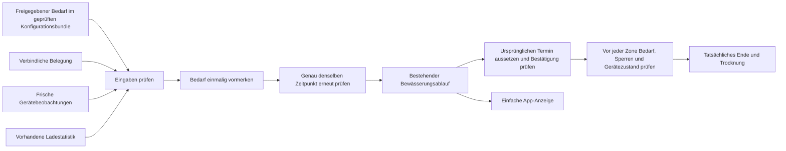

# Bewässerung während des Ladens: Entwicklungsstand und Abnahme

Fortsetzung des Audits vom 09.09.2026. Die vorhandene Hydrawise-Anbindung
bestand bereits. Die hier beschriebene Erweiterung verbindet den bisherigen
Verschiebungsentwurf mit der bestehenden Gesamtsteuerung. Dieser Bericht
ersetzt keine Geräteabnahme und keine Messung im laufenden Betrieb.

## Verarbeitung und Verantwortlichkeit

Es gibt keinen weiteren Timer und keinen zweiten Gerätesender. Die Erweiterung
verwendet `FULL_FAILSAFE`, dessen persistenten Zustand mit Versionsvergleich
und den vorhandenen Ablauf `CUSTOM_NEXT`. Eine Vormerkung löst noch keinen
Gerätebefehl aus. Auch die Annahme eines Befehls gilt nicht als physischer
Stations- oder Ventilnachweis.

`mower/coordination_inputs.py` übernimmt die unveränderliche, bereits geprüfte
Konfiguration. Ein optionaler Block `coordination` enthält `schema_version: 1`,
`enabled` und eine Liste `needs`. Fehlende oder deaktivierte Bedarfsdaten
verhindern ausschließlich diese zusätzliche Optimierung. Aus dem Laden wird
kein Bewässerungsbedarf abgeleitet.

Ein Eintrag bindet `need_id`, `source_plan_id`, `mower_id`, die ursprüngliche
Zonenfolge und Laufzeiten, `original_start_utc`, `earliest_start_utc`,
`latest_start_utc`, `valid_until_utc` und `demand_reference`. `required`,
`timing_window_approved` und `station_and_paths_checked` müssen ausdrücklich
bestätigt sein. Diese Angaben werden serverseitig gepflegt; eine App-Anzeige
oder eine frei übermittelte Startberechtigung ist keine Autorität.

Die Eingabe ist auf 64 Bedarfe und 32 KiB begrenzt. Doppelte Bedarfs- oder
Quellenplan-IDs werden abgelehnt. Die aktuelle Originalfolge muss exakt passen.
Eine Änderung von Zonen, Wetteranpassungen oder Zeiten verlangt eine erneute
fachliche Bewertung des Bedarfs. Die gegenwärtige Prüfung ersetzt keine
Wasserzählung und entscheidet nicht selbst über die nötige Wassermenge.

## Verhalten und Schutzbedingungen

- Der früheste Vorschlag berücksichtigt mindestens 45 Minuten Vorbereitung.
  Sportpuffer und die bisherige Trocknung von mindestens 150 Minuten bleiben
  erhalten. Die ursprünglichen Zonenpausen und Laufzeiten werden bewahrt.
- Bedarf und Quellenplan werden vor der Übernahme dauerhaft vorgemerkt. Ein
  umbenannter Bedarf darf denselben ursprünglichen Lauf nicht erneut ausführen.
  Ein Konflikt mit einem zweiten Prozess verhindert die Aufnahme.
- Die zweite Prüfung gilt exakt für die vorgemerkte Uhrzeit. Ein späterer,
  inzwischen freier Zeitpunkt darf die ursprüngliche Uhrzeit nicht freigeben.
- Eine verlorene Antwort auf einen bereits vorgemerkten Befehl darf keinen
  weiteren Start erzeugen. Die bestehende Wiederherstellung prüft Geräte-
  zustand und Sperren. Ein Neustart entfernt weder Vormerkung noch Stoppsperre.
- Vor einer neuen Zone gelten erneut die unveränderte Bedarfsfreigabe, die
  aktuelle vollständige Platzbelegung und die bestehenden Geräteprüfungen.
  Verspätungen müssen in der verbleibenden Laufzeit und Trocknung Platz finden.
  Ein verspätetes, durch fortlaufende Beobachtung bestätigtes Zonenende
  verschiebt die noch offenen Zonen dauerhaft nach hinten. Die vorgesehene
  Pause wird ab dem nachgewiesenen Ende erhalten; ihre Bestätigung darf sich
  mit dieser Pause überschneiden. Ein Neustart löscht diese Verschiebung nicht.
- Das Deaktivieren der neuen Planung ist keine Anweisung, bereits gesetzte
  Suspendierungen zu vergessen oder geräteeigene Programme sofort freizugeben.
  Parken, Stoppen und die Prüfung unsicherer Vorgänge bleiben erforderlich.

Die dauerhaft gespeicherte Bedarfsliste hat eine konservative Pilotgrenze von
24 Aufnahmen. Sie entfernt keine unbekannten oder noch relevanten Einträge.
Eine volle oder beschädigte Liste verhindert weitere Optimierungen. Vor einer
Ausweitung des Piloten ist eine nachvollziehbare Archivierung beziehungsweise
Fortsetzung mit erhaltener Identität der ursprünglichen Termine erforderlich.

## App und laufende Abfragekosten

Die App verwendet weiter die Struktur **Jetzt** und **Als Nächstes**. Eine reine
Vormerkung zeigt „Bewässerung wird vorbereitet“ und zunächst „Noch offen“ als
Startzeit. Bei einer ungeklärten Ausführung gibt es eine kurze Aufforderung zur
Prüfung der Anlage. Geschätzte Ladeenden bleiben als „Voraussichtlich“ markiert.
Fehlende Zeiten werden nicht durch eine beliebige Uhrzeit ersetzt.

App und neue Planung verwenden denselben fünf Minuten gültigen Statistikcache.
Eine laufende Anfrage wird innerhalb eines Prozesses nicht parallel dupliziert;
verschiedene Abfragekonten und veraltete Daten werden getrennt behandelt.
Verbraucher erhalten eigene Datenkopien. Ein Fehler wird kurz gespeichert und
darf alte Daten nicht als frisch ausgeben. Herstellerabfragen entstehen dadurch
nicht zusätzlich. Der Cache ist pro Prozess; mehrere Azure-Instanzen können
weiterhin eigene Statistikabfragen ausführen. Eine Geldersparnis wurde nicht
gemessen.

[Prüfbare App-Vorschau mit Beispieldaten](../ui-2026-09-09/coordination-execution/appack-preview.html)
und [mobile Aufnahme](../ui-2026-09-09/coordination-execution/mobile-reserved.png).
Diese Aufnahmen stammen aus einem lokal isolierten Browser. Sie belegen keine
Veröffentlichung im Appack-CMS, App-Sitzung, Rolle oder native Geräteansicht.

## Vergleich unter identischen Annahmen

Das bisherige [synthetische Beispiel](integration-coordination-example.json)
bleibt die Grundlage. Am 15.09.2026, Ortszeit Berlin, lädt der Mäher ab 04:00 Uhr.
Das angenommene Ladeende ist 06:00 Uhr. Die Zonen laufen zehn und zwanzig Minuten
mit einer zwanzigminütigen Pause. Die Wasserdauer bleibt insgesamt 30 Minuten.

| Ablauf | Erste Zone | Zweite Zone | Früheste Freigabe nach Trocknung |
|---|---|---|---|
| Bisheriger Termin | 05:30–05:40 | 06:00–06:20 | 08:50 |
| Geprüfter Verschiebungsentwurf | 04:45–04:55 | 05:15–05:35 | 08:05 |

Das sind höchstens **45 Minuten früher nutzbare Platzzeit**. Tatsächliche
Geräte- und Bestätigungsverzögerungen sind zusätzlich zu berücksichtigen.
Produktive Mähminuten bleiben in diesem Vergleich ausdrücklich unbekannt.
Das separate Tagesmodell mit Energie- und Ladezyklen ist eine andere
Simulation; dessen Gewinn darf nicht zu diesen 45 Minuten addiert werden.

## Tatsächlicher Ablaufautomat mit simulierten Geräten

Der zusätzliche [Minutenablauf](coordination-execution-replay.json) führt den
unveränderten öffentlichen Einstieg `run_full_failsafe_cycle` aus. Diese
Offline-Simulation benutzt sieben Zonen mit insgesamt **160 Minuten
Wasserlaufzeit** und ist ein anderes Szenario als das oben genannte Beispiel
mit zwei Zonen. Ihr modellierter Quelltermin beginnt um **04:55 Uhr
Europe/Berlin**; er ist keine Behauptung über den Herstellerplan.

Am simulierten 13.08.2026 wird der Lauf um 04:00 Uhr Berliner Zeit vorgemerkt
und um 04:01 Uhr übernommen. Dazwischen und danach wird der gespeicherte Zustand
neu geladen. Sieben Suspendierungen werden einzeln verarbeitet. Um 04:12 Uhr
erfolgt der simulierte Parkbefehl; anschließend werden neue Stationsmeldungen
geprüft. Die erste Zone läuft von 04:45 bis 05:05 Uhr, die zweite ab 05:08 Uhr.
Die letzte Zone endet tatsächlich im Modell um 07:43 Uhr. Die Ende-Bestätigung
ist um 07:45 Uhr abgeschlossen; die physische Trocknungsfrist endet um
**10:13 Uhr**. Die Bestätigungszeit erzeugt keine weitere vollständige Trocknung.

Der modellierte Quellenplan hätte 04:55 bis 07:35 Uhr vorgesehen. Er enthält
keine erfundene 20-Minuten-Pause; die steuernde Ende-Bestätigung bildet die
dreiminütigen physischen Übergänge im Ablauf ab. Dies ist ein synthetischer
Soll-/Ablaufvergleich, keine Messung zusätzlichen produktiven Mähens und kein
vollständiger Vergleich zweier realer Geräteprogramme. Der frische
Hydrawise-GET-Nachweis vom 09.09. maß dagegen sieben Zonen von 04:30 bis 07:10
Uhr Europe/Berlin ohne Pause; die reale Anlage muss vor jeder Aktivierung
erneut gegen diesen aktuellen Nachweis geprüft werden.

Der simulierte Hersteller prüft jeden der sieben ursprünglichen Starttermine
tatsächlich gegen die angenommenen Suspendierungen: **sieben unterdrückte
Termine, null zusätzliche native Starts, genau ein koordinierter Start je Zone**.
Weitere Ablaufvarianten belegen:

- Eine verlorene Startantwort lässt die simulierte Zone laufen. Nach Neustart
  bestätigt die Steuerung diesen Zustand ohne zweiten Startbefehl.
- Zurückgenommene Bedarfsfreigabe vor Zone zwei verhindert weitere Starts.
- Drei Minuten fehlender sicherer Mähernachweis verschieben die erste Zone.
  Nach einem weiteren Neustart bleibt die physische Ende-Bestätigung erhalten.

Die simulierte Station, Suspendierung und Ventilreaktion sind ausdrücklich
Testannahmen. Diese Tests belegen die Softwareübergänge und ersetzen deren
Prüfung an der realen Anlage nicht.

Abschließender lokaler Gesamtlauf: **1.020 Python-Tests und 425 Untertests**
erfolgreich, einschließlich der vier vollständigen Ablaufvarianten.
**102 Appack-Tests** erfolgreich. Drei lokale Browseraufnahmen hatten keine
JavaScript-Fehler und boten bei ungeklärter Koordination keine konkurrierenden
Start- oder Planänderungsaktionen. Nachweise:
[Python](coordination-execution-tests.xml),
[Appack](coordination-execution-appack-tests.txt),
[Browser](../ui-2026-09-09/coordination-execution/browser-check.json).

## Ergänzung der Maßnahmen- und Risikotabellen

| ID | Bereich | Problem und Ursache | Nachweis | Verbesserung | Erwarteter Impact | Aufwand | Abhängigkeiten | Änderungsrisiko | Risikominderung | Abnahmekriterium | Priorität |
|---|---|---|---|---|---|---|---|---|---|---|---|
| P02 | Gemeinsame Steuerung | Entwurf bisher ohne persistenten Verbraucher; Wiederholung könnte Wasser doppelt ausführen | Codeprüfung und gezielte Fehlerfälle | Einmalige Aufnahme innerhalb des bestehenden Automaten | Ermöglicht abgestimmte Ausführung; keine gemessenen Mähminuten | Mittel | Freigegebener Bedarf, sichere Station, Quellen- und Gerätebelege | Hoch | Standard aus, persistente Identitäten, erneute Prüfung, gleiche Sperren | Keine zweite Ausführung nach Neustart/Antwortverlust; Originaltermin unterdrückt | P1 |
| P03 | Zeitprüfung | Neu gerechneter Zeitpunkt konnte von reserviertem Zeitpunkt abweichen | Regression mit Belegung nur in der ersten Minute | Exakte Prüfung des gespeicherten Zeitpunkts | Verhindert falsche Freigabe; keine Wassermengenänderung | Klein | Vollständige Belegung | Mittel | Zeitbindung und Tests | Gesperrter Originalzeitpunkt bleibt gesperrt | P0 |
| P04 | Zonenabstände | Absolute Zeiten allein verkürzen bestätigte Übergänge bei Verspätungen | Tatsächlicher Ablaufautomat im isolierten Test und Verspätungsregressionen | Quellenabstände und Ende-Bestätigungen im koordinierten Pfad persistent weitergeben | Erhält nachgewiesene Abstände; verhindert falsche Restzeitplanung | Mittel | Frische Ende-Beobachtungen, unveränderte Quelle | Mittel | Übrige Verbraucher behalten bisherige Regeln; verbleibendes Zeitfenster erneut prüfen | Gemessene Quelle bleibt ohne erfundene Pause; bestätigte Übergänge bleiben auch bei spätem Start und Neustart erhalten | P0 |
| U03 | Bedienung | Vormerkung oder ungeklärter Ablauf könnte als sichere Startzeit erscheinen | Browser- und UI-Tests | Einfache Meldungen, offene Zeiten, passende Bedienmöglichkeiten | Bessere Verständlichkeit | Klein | Aktueller Backendstatus | Klein | Gefahrenmeldungen behalten Vorrang | Keine optimistischen Zeiten oder konkurrierenden Starts bei unklarem Ablauf | P1 |
| A02 | Statistikauswertung | App und Optimierer könnten dieselbe Auswertung mehrfach anfragen | Nebenläufigkeits- und Isolationstests | Gemeinsamer begrenzter Cache | Weniger doppelte Abfragen je Prozess; Geldwirkung ungemessen | Klein | Vorhandene Statistikberechtigung | Klein | Trennung nach Konto, tiefe Kopien, Zeitprüfung, Fehlerablauf | Ein Abruf bei parallelen Erstlesern; keine fremden/veralteten Daten | P2 |
| T02 | Tests | Vergessenes Test-Double könnte eine echte Verbindung aufbauen | Netzwerkschutztest | Netzwerkzugriff in pytest-Läufen standardmäßig gesperrt | Verhindert unbeabsichtigte Geräteaufrufe aus Tests | Klein | pytest | Klein | Verletzung ist ein Testfehler und nicht als API-Ausfall verschluckbar | Kein echter Socket-Aufbau während Tests | P0 |

| Risiko | Wahrscheinlichkeit / Schaden | Erkennung | Prävention | Wiederherstellung | Restrisiko |
|---|---|---|---|---|---|
| Native Bewässerung läuft zusätzlich | Ungeklärt / hoch | Quellbeobachtungen und lokaler Pilot | Originaltermin aussetzen, vor jeder Zone prüfen | Wasser stoppen, Mäher sichern, Plan vor Ort abgleichen | Ein zentraler Dienstausfall kann geräteeigene Abläufe nicht vollständig beherrschen |
| Geräteantwort verloren | Möglich / hoch | Persistierte offene Anforderung | Vor Versand speichern, keine blinde Wiederholung | Gerätebeobachtung und gezielte Prüfung | Tatsächliche Annahme bleibt bis Beobachtung unbekannt |
| Bedarf oder Belegung ändert sich | Möglich / hoch | Erneuter Hash- und Zeitvergleich | Vor Aufnahme und jedem Start erneut prüfen | Neue Zone zurückhalten, Sperren erhalten, Bedarf prüfen | Eine Änderung nach der letzten Prüfung kann erst mit dem nächsten Status erkannt werden |
| Empirische Ladeprognose fehlt | Wahrscheinlich bei lückenhafter Historie / gering | Fehlende vergleichbare abgeschlossene Ladeabschnitte | Keine frei erfundene Prognose | Weiterhin bisherigen Termin verwenden | Möglicher Mähzeitgewinn bleibt ungenutzt |
| Fehlende Feld-/Stationsprüfung | Ungeklärt / hoch | Nachweis ausdrücklich erforderlich | Keine Aktivierung ohne fachliche Freigabe | Beaufsichtigte Ortsprüfung | Ferndaten allein bestätigen keine sichere Fläche |
| Regen- oder Sensoränderung nach Übernahme | Ungeklärt / mittel bis hoch | Geänderte Freigabe oder externe Beobachtung; tatsächliches Herstellerverhalten offen | Bedarf nur für konkret geprüften Zeitraum freigeben; Regen-/Sensorwirkung im Pilot nachweisen | Weitere Zonen sperren, Bedarf zurücknehmen, ursprüngliche Programme kontrolliert wiederherstellen | Der Adapter berechnet keinen eigenen Wasserbedarf; eine unveränderte Freigabe beweist keine nachträgliche Wetteränderung |

## Einführung und noch offene Nachweise

Die Erweiterung ist standardmäßig deaktiviert. Für eine spätere begrenzte
Aktivierung sind zusätzlich zu den bestehenden `FULL_FAILSAFE`-Schreibgates
`COORDINATION_EXECUTION_ENABLED=true` und die exakte Bestätigung
`COORDINATION_EXECUTION_CONFIRMATION=SSV53-COORDINATED-IRRIGATION-PILOT-V1`
erforderlich. Diese Werte wurden nicht produktiv gesetzt.

Vor einem Pilot bleiben verbindliche Bedarfs- und Zeitfenster, Stations- und
Zufahrtsprüfung, Abgleich der nativen Geräteprogramme, installierte Bytes,
beobachteter Parallelvergleich sowie betreute Fehler- und Rückkehrereignisse
erforderlich. Der [gestufte Betriebsplan](rollout-and-operations.md) gilt weiter.
Ein Rückfall muss offene Anforderungen und die verbleibenden Suspendierungen
mitnehmen. Ein Code-Rollback allein kann keine Geräteaktion zurücknehmen.

Die übrigen Grenzen aus dem [Freigabestand](../ui-2026-09-09/release-readiness.md)
bleiben bestehen: verbindlicher Trainingskalender, zugelassener Abfragetakt
für einen späteren Hydrawise-Cache und tatsächliche App-/Geräteabnahme.
Eine Option im Entwicklungsbranch ist keine vollständige Einführung.

Die aktuellen PR-Prüfungen verwenden `pytest` und führen damit auch die neuen
Ablauftests aus. Ältere manuell aufrufbare Installer mit `unittest discover`
führen freie pytest-Testfunktionen nicht aus und verwenden deren Netzwerksperre
nicht. Ein grünes Ergebnis eines solchen Installers ist keine vollständige
Abnahme dieses Standes; er darf den aktuellen PR- und Paketnachweis nicht ersetzen.

Routinearbeiten wurden mit Luna, die Zustandsintegration mit Terra und die
abschließende Ablaufwiederholung mit Sol bearbeitet. Astra prüfte die Integration
und korrigierte die dabei nachgewiesenen Fehler. Es wurden keine
kostenpflichtigen Ressourcen angelegt.

Die Nachweise dieser Fortsetzung werden getrennt von den historischen
Lieferständen unter [coordination-execution-delivery.json](coordination-execution-delivery.json)
abgelegt. Der Quellpaketnachweis lässt sich mit
`scripts/verify_full_failsafe_delivery.py --commit <SHA> --output dist/<Name>.zip --report <Bericht>.json`
wiederholen. Das Werkzeug baut aus den unveränderten Git-Bytes, vergleicht jede
Datei und importiert das entpackte Programm mit gesperrtem Netzwerk. Es führt
keine Installation durch.

Quellstand: [c4fd6e7a25d7318950145687fd93f97af0728186](https://github.com/Rohdeo87/ssv53-heimspiele/commit/c4fd6e7a25d7318950145687fd93f97af0728186).
Das lokale Paket `dist/ssv53-platzpflege-coordination-20260909-source.zip`
enthält **56 Quelldateien und ein Manifest**. Jede Quelldatei stimmt byteweise
mit diesem Commit überein. Der isolierte Import registrierte **14 Funktionen**.
Paket-SHA256: `f0b057e8a0de9dca1c9b233a444f89402206fde5db80a673e663b9d6b9ca4807`.
Remote-Build-Abhängigkeiten und die produktiv installierten Dateien sind
weiterhin nicht nachgewiesen.
