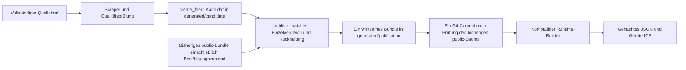

# I03: Neue Belegungen übernehmen, ungeklärte Rücknahmen weiter sperren

Stand: 9. September 2026. Entwicklungsänderung im Worktree `audit-platzpflege`, Branch `audit/platzpflege-20260909`, ausgehend von Commit `734656bc0fe24c2d77d33e9cca60fc371854723b`. Dieser Bericht bezeichnet lokale Änderungen und Tests. Er ist kein Nachweis eines veröffentlichten Bundles, eines Softwaredeployments oder eines Geräteverhaltens.

## Ursache und Ziel

Der bisherige [Änderungswächter](../../report_changes.py) verglich den gesamten neuen Bestand mit der bisherigen Veröffentlichung. Eine noch nicht bestätigte sicherheitsrelevante Rücknahme setzte den gesamten Lauf auf `blocked`. Der [Importworkflow](../../.github/workflows/update-matches.yml) speicherte dann auch neue, bereits validierte Belegungen nicht. Damit konnte eine ungeklärte Löschung die Berücksichtigung eines neu angesetzten Spiels an einer ganz anderen Stelle verhindern. Dies ist eine im Code und in Offlineabläufen reproduzierte Ursache; für I03 werden keine zusätzlichen Livefehler behauptet.

Ein Zusammenführen nur von `matches.json` hätte das Problem nicht vollständig gelöst: Der [Runtime-Builder](../../scripts/build_runtime_config_bundle.py) erzeugt die Geräte-ICS und den strukturierten App-Feed erneut aus `included_matches.json`. Beide Wege müssen denselben wirksamen Bestand erhalten.

Das Ziel ist eine konservative Veröffentlichung: Vollständig validierte neue Belegungen wirken sofort; eine bisherige Sperre fällt erst nach belastbarer Rücknahmebestätigung, ausdrücklicher Prüfung oder Ablauf ihres bisherigen Endzeitpunkts weg. Die bestehenden Spielpuffer von jeweils 60 Minuten werden nicht verändert.

## Umgesetzter Datenweg



Der neue [Publisher](../../publish_matches.py) ruft keine externe Quelle ab und versendet keine Gerätebefehle. Er bereitet die Dateien in einem neuen Verzeichnis vor. Erst nach vollständiger Erstellung und erneuter Prüfung wird das Ausgabeverzeichnis sichtbar. Ein Fehler beim Schreiben der zweiten ICS-Datei hinterlässt weder einen teilweise ersetzten Bestand noch einen fortgeschriebenen Bestätigungszustand.

Der Workflow erstellt den Quellkandidaten nicht mehr unmittelbar unter `public/`. Er übernimmt ausschließlich das erfolgreich vorbereitete Gesamtbundle. Rohbestand, beide Kalender, strukturierter Feed, Quellenbelege und Bestätigungszustand werden gemeinsam committed. Hat ein anderer Prozess den Git-Baum `public` inzwischen verändert, bricht die Speicherung ab und fordert einen neuen Vergleich gegen diesen Stand. Ein lokaler Test führt genau diesen Vergleichsblock mit zwei simulierten Veröffentlichungsständen in einem isolierten Git-Repository aus.

## Zustände, Identität und Freigaberegeln

| Fall | Verhalten |
|---|---|
| Neue gültige Belegung | Sofort mit ihrer bisherigen offiziellen Kennung `dfb:<Quell-ID>` im wirksamen Bestand enthalten. |
| Verlegung, Platzwechsel oder verkürzte Sperre | Neuer Zustand wird übernommen. Die bisherige Belegung bleibt zusätzlich als eindeutig bezeichnete Rückhaltesperre enthalten. |
| Verschwundenes oder als abgesagt ausgeschlossenes Spiel | Bisherige Sperre bleibt erhalten. Der aktuelle Quellbestand und der weiterhin wirksame Bestand werden getrennt nachgewiesen. |
| Bestätigte Rücknahme | Zwei identische, vollständige Quellbeobachtungen mit mindestens 60 Minuten Abstand bestätigen die einzelne Änderung. Die tatsächliche Abrufzeit zählt; die Uhrzeit einer erneuten Dateiverarbeitung zählt nicht. |
| Unabhängig neu hinzugefügtes Spiel | Setzt die Bestätigungsserie einer unveränderten Rücknahme nicht zurück. |
| Erneute Verlegung vor Bestätigung | Jede noch ungeklärte alte Sperrversion bleibt erhalten; die geänderte Rücknahme beginnt eine neue Bestätigungsserie. |
| Leerer Abruf | Ohne ausdrücklich gesetzte Ausnahme kein neues Bundle und keine Erneuerung der Quellenfrische. Auch wiederholte leere Abrufe bestätigen keine Freigabe. |
| Fehlgeschlagener, unvollständiger oder widersprüchlicher Abruf | Keine Veröffentlichung; bisheriger Stand und Bestätigungszustand bleiben erhalten. Die Ausnahme für große Rücknahmen umgeht diese Qualitätsprüfung nicht. |
| Großer Datenverlust | Neue valide Sperren werden übernommen. Die dadurch betroffenen alten Sperren benötigen weiterhin ausdrückliche Prüfung. Diese Sperre bleibt auch bestehen, wenn der nächste Vergleich bereits gegen einen verkleinerten Quellbestand läuft. |
| Bisherige Belegung außerhalb des neuen Abrufhorizonts | Keine automatische Rücknahmebestätigung durch diese Quelle; Klärung beziehungsweise zeitlicher Ablauf erforderlich. |
| Fehlender oder beschädigter Bestätigungszustand | Bestätigung beginnt konservativ neu. Die alten Sperren stehen außerdem im wirksamen Bundle und werden nicht vergessen. |
| Fehlender oder beschädigter Primärbestand | Kein stillschweigender Wechsel zu einer leeren Vergleichsbasis. Ein bestehender, aber unvollständiger Bundle-Ordner wird abgelehnt. |
| Rückkehr des ursprünglichen Quelltermins | Eine identische oder umfassendere neue Sperre deckt die alte ab. Eine zwischenzeitlich neu beobachtete andere Sperre wird ihrerseits bis zur Klärung erhalten. |

Die Rückhaltekennung `dfb:held-<SHA-256>` wird aus der ursprünglichen Quell-ID, dem Platz und den normalisierten ursprünglichen Zeitpunkten gebildet. Sie ist weder laufnummernabhängig noch an einen bestimmten realen Spieltermin angepasst. JSON und ICS verwenden dieselbe Identität mit ihren jeweils üblichen Präfixen. Wiederholungen, ein neuer Prozess und ein Wechsel zwischen gleichwertigen Zeitstempelrepräsentationen verändern diese Identität nicht.

`publicationRetention` im strukturierten Feed und `publication_retention` im Rohbestand dokumentieren unter anderem ursprüngliche Quell-ID, letzte ursprüngliche Quellenbeobachtung, Rückhaltegrund, Bestätigungszähler und die erforderliche Freigabestufe. Titel und Beschreibung lauten erkennbar „Sperre bis Klärung“. Der Belegungsdienst übernimmt diese Anzeige; die Mannschafts- und Kontaktdaten bleiben strukturiert erhalten. Es gibt in dieser Änderung keine neue Frontendfreigabe und keinen manuellen Steuerungsendpunkt.

## Kohärenz und Schutz vor alten Consumern

Eine wichtige Abhängigkeit wurde im unabhängigen Review reproduziert: Der ältere Builder aus Commit `9c2d0fc9c010b366cd49b58b8086b27f9d59a0dd` würde einen alten C-Junioren-Termin mit 105 Minuten erneut auf die aktuelle 85-Minuten-Regel berechnen und dabei dessen noch notwendige Rückhaltung verkürzen. Bei einem Anstoß um 18:00 Uhr änderte sich das Ende der zurückgehaltenen Sperre fälschlich von 20:45 auf 20:25 Uhr. Der neue Builder erhält diesen bisherigen Zeitraum unverändert.

Zusätzlich verhindert eine Formatgrenze diesen Fehler bei versehentlich getrennter Einführung:

```json
{
  "schemaVersion": 2,
  "kind": "retained-occupancy",
  "requiredConsumer": "ssv53-additive-retention-v1",
  "publication": {"...": "gemeinsamer Veröffentlichungsnachweis"},
  "matches": []
}
```

Sobald Rückhaltesperren vorkommen, verwendet `included_matches.json` diesen versionierten Container mit dem vollständigen Bestand. Alte Builder, die ausdrücklich eine Liste erwarten, lehnen ihn vor der Ausgabe ab. Der [eingefrorene Originaldecoder als Testfixture](../../tests/fixtures/runtime_bundle_legacy_list_decoder_9c2d0fc.py) und ein zusätzlicher unabhängiger Lauf des tatsächlichen alten Git-Codes belegen diese Ablehnung. Ohne Rückhaltesperren bleibt das bisherige Rohlistenformat erhalten. Der strukturierte `matches.json`-Feed und die beiden ICS-Dateien behalten ihre konsumierbare Form.

Der gemeinsame Veröffentlichungsnachweis bindet den wirksamen Rohbestand über `effectiveDigest`, Abrufzeit, Quellanzahl, Anzahl zurückgehaltener Sperren, Gesamtanzahl und erforderlichen Consumer. Er steht konsistent im Primärfeed, im versionierten Container, in `summary.json` und in `quality_report.json`. Der neue Runtime-Builder prüft die Bindung vor jeder Neuberechnung. Auch die Kalenderzählungen des Qualitätsberichts werden verglichen. Gemischte Dateien mit zufällig gleicher Gesamtanzahl gelten nicht als kohärentes Bundle.

Die bisherige Quelle wird separat in `source_matches.json`, `source_summary.json`, `source_quality_report.json` und `source_all_matches.json` erhalten. Vor dem nächsten Vergleich werden Digest, Schema, Abrufzeit und kanonische Quellzeilen gegen den Primärfeed geprüft. Das verhindert insbesondere, dass eine beschädigte, scheinbar leere Quellenhistorie den Wächter für große Datenverluste umgeht. Dieser Fall wurde unabhängig reproduziert und als Regression abgesichert.

Die alte Datei `state/change_guard_state.json` wird im neuen Veröffentlichungsweg nicht fortgeschrieben oder als Freigabenachweis verwendet. Der neue Zustand liegt als `publication_state.json` im gemeinsam veröffentlichten Bundle. Beim Übergang werden ungeklärte Rücknahmen konservativ neu bestätigt.

## Zeiten und Überlappungen

Die Zeitregel wird für neue Quellzeilen erneut geprüft. Zurückgehaltene Zeilen müssen in sich konsistente Spielzeiten und die unveränderten Vor- und Nachläufe besitzen. Sie werden im Runtime-Build nicht nach einer inzwischen anderen Dauerregel verkürzt.

Der ICS-Export wandelt explizite Zeitpunkte korrekt in Berliner Zeiten um. Bei der doppelt vorkommenden Herbststunde wird UTC verwendet, damit auch deren zweite Ausprägung eindeutig bleibt. Tests vergleichen die tatsächlich vom Kalenderleser gelesenen Zeitpunkte mit den JSON-Sperren, einschließlich Mitternacht, UTC-Eingaben und beider Ausprägungen der Herbststunde. Dies ersetzt keine erneute Abnahme des Appack-WebViews auf echten Geräten.

Überlappende alte und neue Sperren bleiben identifizierbar. Ihre Dauern dürfen für eine Betriebsstatistik nicht einfach addiert werden; maßgeblich ist die Vereinigung der blockierten Zeiträume. I03 behauptet keine gemessene Steigerung produktiver Mähminuten. Der nachgewiesene unmittelbare Nutzen ist die zuverlässige Berücksichtigung neuer Sperren trotz anderer ungeklärter Rücknahmen. Ein Lauf kann dadurch erfolgreich gültige neue Daten bereitstellen, ohne alte Schutzzeiten freizugeben.

## Nachweise und Abdeckung

Eigene gezielte Prüfung:

```powershell
& ../.audit-venv/Scripts/python.exe -X utf8 -m pytest -q tests/test_additive_publication.py tests/test_change_report.py tests/test_import_guard_persistence.py tests/test_runtime_config_bundle.py tests/test_create_feed.py tests/test_notifications.py
```

Ergebnis: **104 Tests bestanden**, darunter **70 neue Fälle** in [test_additive_publication.py](../../tests/test_additive_publication.py). Die Testfälle sind vollständig lokal; sie rufen weder Quellen-APIs noch echte Geräte auf.

| Prüfgruppe | Nachweis |
|---|---|
| Verlegung mit gleicher oder neuer ID, Platzwechsel, zusätzliche neue Spiele | Alter und neuer Zeitraum sind im ersten wirksamen JSON-/ICS-Bundle vorhanden. |
| Löschung und ausdrücklich abgesagter Quelldatensatz | Rückhaltung im ersten Abruf; kontrollierte Freigabe nach getrennter Bestätigung. |
| Wiederholung, Neustart, mehrere Verlegungen, Rückkehr zum Original | Kopiertes Bundle als Neustartbasis; Wiederverarbeitung derselben Datei bestätigt nichts; Kennungen bleiben stabil. |
| Quellenfehler | 17 gezielt beschädigte Quellenformen, unter anderem fehlende Zeilen, falsches Format, falsche Zeiten, Zählungen, Partitionen, Teilfenster, Pagination und unbekannte Prüfzustände. |
| Leerer Abruf und große Verluste | Keine unbestätigte Freigabe; die manuelle Sperre für große Verluste bleibt über Folgeabrufe und verlorene Beobachtungszähler bestehen. |
| Persistenz und Konkurrenz | Abbruch beim zweiten ICS-Schreibvorgang ohne Teilveröffentlichung; tatsächlicher Git-Baumvergleich bei konkurrierenden Publikationen. |
| Consumer-Kompatibilität | Alter Decoder lehnt Container ab; neuer vollständiger Runtime-Build erhält eingefrorene Sperren. |
| Bindung zusammengehöriger Dateien | Zehn gezielte Fehlerfälle gegen inkompatible oder gemischte Publikationen; unter anderem gleiche Anzahlen mit anderen Quellzeilen sowie falsche Kalenderzählungen. |
| Backend-Anzeige | Der tatsächliche strukturierte Belegungsleser liefert beide Sperren und den verständlichen Rückhaltetitel. |
| Alarmierung | Technisch erfolgreiche additive Aktualisierung schließt eine weiterhin berechtigte Rücknahmewarnung nicht versehentlich. Identische offene Warnungen werden dedupliziert. |

Das unabhängige Schlussreview meldete **112 bestandene Tests** aus Publikation, Runtime, Änderungsbericht, Benachrichtigung, Workflowprüfungen und Import über Abruffenster hinweg. Zusätzlich wurden der tatsächliche vollständige alte Builder, der vollständige neue Builder, eine Folgepublikation nach 30 beziehungsweise 60 Minuten und zehn getrennte Fehlerinjektionen geprüft. Zum Abschluss dieses abgegrenzten Reviews bestanden keine offenen P1-/P2-Befunde.

Der gesamte zu diesem Zeitpunkt vorhandene Python-Testbestand des gemeinsamen Worktrees bestand ebenfalls: **912 Tests und 423 Untertests** in 17,74 Sekunden. Andere Agenten arbeiteten im selben Worktree an getrennten Maßnahmen; diese Gesamtzahl ist deshalb ein lokaler Standnachweis und keine Aussage über eine bereits gebaute oder veröffentlichte Revision.

Der reale, in diesem Checkout vorhandene Altbestand wurde zusätzlich lesend auf Verwendbarkeit als Ausgangsbasis geprüft: 42 strukturierte Spiele, Abrufzeit `2026-08-18T20:07:58+00:00`. Dieser alte Stand ist kein aktueller Liveimport. I03 führt keinen neuen Livevergleich gegen FUSSBALL.DE durch.

## Impact und verbleibende Risiken

| Thema | Wirkung / Risiko | Minderung und Auflösungsbedingung |
|---|---|---|
| Neue Sportbelegung | Neue valide Termine werden nicht durch eine unabhängige Rücknahme zurückgehalten. | Integrationstests prüfen den sofort wirksamen vollständigen Bestand. |
| Mähzeit | Alte unsichere Sperren bleiben zunächst bestehen; daraus darf kein unbelegter Mähzeitgewinn abgeleitet werden. | Einzelbestätigung verhindert, dass unabhängige Änderungen die Klärung immer wieder zurücksetzen. Betriebsgewinn erst im Parallelbetrieb messen. |
| Wiederholte Verlegungen | Mehrere alte Sperren können vorübergehend gleichzeitig bestehen. | Eindeutige Kennungen, verständliche Kennzeichnung, getrennter Alarm und Ablauf nach bisherigem Sperrende. |
| Veränderte Quellhorizonte oder großer Datenverlust | Einzelne Sperren können bis zur menschlichen Prüfung oder bis zum Ablauf bestehen bleiben. | Betroffene Quell-ID und Freigabestufe werden konkret genannt; kein unbegründeter globaler Dauersperrstatus. |
| Veralteter Runtime-Consumer | Ein getrennt eingeführter Publisher könnte sonst alte Sperren verkürzen lassen. | Versioniertes Rohformat erzwingt Ablehnung alter Builder; kompatiblen Consumer zuerst bereitstellen und nachweisen. |
| Gemischte oder beschädigte Artefakte | Zufällig gleiche Zählungen reichen als Qualitätsbeweis nicht aus. | Digest- und Metadatenbindung plus atomarer Git-Commit und Abbruch bei geändertem Vergleichsbestand. |
| Zentraler Ausfall / Manifest bleibt alt | Die Formatgrenze stoppt einen unpassenden Build, installiert aber keine neue Steuerungssoftware und stoppt selbst keine autonom laufenden Geräte. | Bestehende Quellalter- und Geräteschutzregeln beibehalten; Betriebszustand separat prüfen. |
| Bewässerung | Keine Veränderung von Bedarf, Zonen, Trocknungszeit oder Geräten. | Gemeinsame verbindliche Belegung erreicht nach kompatiblem Rollout die bestehende Planung. |

## Einführung, Abnahme und Rückfall

1. **Consumer zuerst prüfen.** Den neuen Runtime-Builder einschließlich `publish_matches.py` und des aktualisierten gemeinsamen Matchmodells auf dem tatsächlich verwendeten Build-Branch bereitstellen. Den Stand über Commit und erzeugtes Artefakt belegen. Ein grüner Importlauf auf `main` allein erfüllt dies nicht.
2. **Alten Consumer im Test gezielt ablehnen lassen.** Ein Bundle mit zurückgehaltener Sperre muss beim alten Listen-Consumer scheitern. Der bisherige Runtime-Manifeststand muss dabei unverändert bleiben. Ein solcher Fehler ist eine Einführungsgrenze, kein Anlass, die Qualitätsprüfung zu umgehen.
3. **Additiven Publisher zunächst ohne Veröffentlichung beobachten.** Mindestens eine Verlegung, eine bestätigte Löschung, einen unveränderten Wiederholungsabruf, einen Quellenfehler und einen Neustart durchspielen. JSON-/ICS-Zeiträume und die Rücknahmealarme mit dem bisherigen Verhalten vergleichen. Neue Sperren müssen im ersten gültigen Kandidaten enthalten sein; alte dürfen nicht vor bestätigter Klärung fehlen.
4. **Produktive Datenfreigabe erst nach Versionsnachweis.** Der Auftrag dieses Arbeitspakets enthält keine Produktionsaktion. Der spätere Freigabeschritt muss den genauen Consumer- und Publisher-Stand, das geprüfte Kandidatenbundle und die erwartete Quellfrist benennen. Ist die neue Consumer-Version nicht nachgewiesen, muss der automatische Weiterbau vor der Publisher-Aktivierung ausgesetzt bleiben.
5. **Überwachter begrenzter Betrieb.** Nicht nur erfolgreiche Workflows zählen. Den tatsächlich geladenen Manifest-/Bundle-Stand und die aus ihm gelesenen Sperren nachweisen. Mindestens zwei vollständige Abrufzyklen sowie eine echte relevante Änderung beobachten; bei fehlendem Ereignis die Beobachtung verlängern.

Abbruchkriterien sind insbesondere eine fehlende neue Belegung, eine vorzeitige alte Freigabe, widersprüchliche Kalender, eine unbekannte Consumer-Version oder ein nicht zuordenbarer Geräte-/Softwarestand. Der Rückfall darf einen einmal veröffentlichten additiven Bestand nicht einfach durch den älteren Feed ersetzen: Dieser ältere Stand kennt die neu hinzugekommenen Sperren möglicherweise noch nicht. Zunächst den letzten vollständigen konservativen Bestand und seine offenen Rückhaltesperren sichern, automatische Weiterveröffentlichungen anhalten und eine auf dieser Basis kompatible Wiederherstellung vorbereiten. Geräteinterne Zeitpläne und bereits angenommene Befehle gehören zusätzlich in den übergeordneten Betriebsrückfallplan; ein Import-Code-Rollback löst sie nicht auf.

Offen bleiben der tatsächliche Rollout auf allen beteiligten Branches, ein neuer Liveimportvergleich, der Parallelbetrieb mit echten Betriebsdaten und die Geräte-/Appack-Abnahme. Diese Schritte benötigen konkrete Versions- und Betriebsnachweise sowie die jeweils erforderliche menschliche Freigabe. Verbindliche Nutzungs-, Wasser- oder Sicherheitsregeln werden durch I03 nicht geändert.
