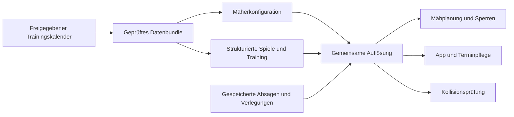

# Fortsetzung: gemeinsame Quelle und belastbare Bestätigungen

Stand 09.09.2026. Dieser Bericht ergänzt das [Gesamtaudit](README.md) und den
[Freigabestand](../ui-2026-09-09/release-readiness.md). Er betrifft den
Entwicklungsbranch. Es wurden keine Gerätebefehle, Produktivänderungen,
Nachrichten oder CMS-Veröffentlichungen ausgeführt.

## Ergebnis und nachgewiesene Ursachen

App, serverseitige Terminpflege und Mäher erzeugten Training bisher unabhängig.
Insbesondere konnte eine vom Client gewählte Winteransicht die sichtbaren Plätze
begrenzen, während der Mäher weiterhin nach einem anderen Trainingsmuster
plante. Die neue Quelle wird identisch in Mäherkonfiguration und strukturierten
Spielbestand eingebettet. Beide Dateien sind durch dasselbe vorhandene
Veröffentlichungsmanifest gebunden; weitere Herstellerabfragen entstehen nicht.

Die Laufzeit verwendet denselben Validator und dieselben nominalen und
gepufferten Zeiten. Absagen werden erst ab ihrer gespeicherten Freigabezeit
wirksam. Die serverseitige Konfliktprüfung, das Absagen-Listing, der Lookup für
Verlegungen und die Benachrichtigungsberechnung sind angeschlossen. Verlegungen
unterdrücken das Original nur anhand gespeicherter, geprüfter Belegungsdaten.
Puffer werden nicht erneut addiert. Ein Zeitraum von 64 örtlichen Tagen bleibt
auch über die Herbst-Zeitumstellung gültig.

Ein zweiter Fehler lag zwischen Hashprüfung und Verwendung von Cachedateien:
ein paralleler Abruf konnte einen festen Dateipfad bereits überschrieben haben.
Beide Resolver geben nun unveränderliche Momentaufnahmen der geprüften Bytes
zurück. Mäherkonfiguration und ICS werden als Paar gebunden. Ein beschädigter
Cache bleibt unbrauchbar; er wird nicht als neue Freigabe ausgelegt. Die lokalen
Momentaufnahmen brauchen Speicher, aber keine neue Azure-Ressource. Eine
Aufbewahrungsgrenze für diese kurzlebigen Hostdateien bleibt vor Langzeitbetrieb
festzulegen; unbedachtes Löschen könnte noch laufende Leser treffen.

Auch direkte Hydrawise-Abfragen konnten denselben Herstellerzeitpunkt erneut
liefern. Die Bestätigung durfte dann nicht mit der Uhr des nächsten Timerlaufs
fortschreiten. Die Gerätepfade verwenden jetzt die tatsächliche Quellzeit,
persistieren verwendete Beobachtungen und prüfen die Zeitgrenze des jeweiligen
Befehls. Ältere Zustände beginnen fehlende Nachweisketten konservativ neu.
Zu große Lücken starten die kurze Bestätigung erneut. Ein weiterhin gültiger
Cachetreffer erhält eine bestehende Kette, verlängert deren Nachweisende aber
nicht. Physische Trocknung und Datenvertrauen bleiben getrennt.

## Wirkung, Risiken und Abnahme

| ID | Änderung | Erwartete Wirkung | Änderungsrisiko und Minderung | Abnahme |
|---|---|---|---|---|
| O01 | Gemeinsame Trainingsquelle einschließlich Pflege | Weniger widersprüchliche Sperren und Anzeigen; kein belastbarer Minutengewinn ohne verbindlichen Kalender | Fehlerhafte Saison-/Ferienpflege könnte Belegung verlieren. Inhaltsbindung, Vergleich beider Ausgangsquellen, explizite Freigabe und Standard OFF | Gleiche Ereignisse und Sperrzeiten in App, Mäher und Pflege; fehlende Quelle erzeugt keine Freigabe |
| O02 | Unveränderliche Eingabedateien | Keine Kombination verschiedener Veröffentlichungen innerhalb eines Lesevorgangs | Beschädigung oder Speicherknappheit führt zum Fehler. Byteprüfung, atomare Einzeldateien, definierter Wiederabruf; Hostspeicher im Pilot beobachten | Bereits zurückgegebene Version bleibt nach Folgeabruf unverändert |
| A01 | Bestätigung nach Quellbeobachtungen | Keine Freigabe durch wiederholte oder vor einem Befehl erhobene Daten; keine erneute physische Trocknung durch bloßen Cachetreffer | Strengere Nachweise können unbrauchbare Anbieterzeitstempel sichtbar machen. Offline-Fehlerinjektion, konservative Migration und Cache-Gates erhalten | Wiederholung, Rückwärtszeit, große Lücke, verlorene Antwort und Neustart können keine Bestätigung vortäuschen |
| P01 | Deterministischer Entwurf einer Verschiebung | Behält Zonenfolge, Abstände und Wasserdauer; Beispiel 45 Minuten früher nutzbarer Platz | Entwurf ist noch kein sicherer Geräteadapter. Stabile Bedarf-/Planbindung, erneute Eingangsprüfung und keinerlei Versandfunktion | 45-Minuten-Vorlauf, unveränderte Pausen und Dauern, gleiche Request-ID beim Replay, explizit keine Startberechtigung |
| U02 | Saisonwahl bei gemeinsamer Quelle entfernen | Klare Platzwahl; ein gespeicherter Winterfilter versteckt kein Rasentraining | Alte oder fehlerhafte App-Version könnte weiter filtern. UI-Regression und verbindliche CMS-/Geräteabnahme vor ACTIVE | Beide Plätze sichtbar, persönliche Platzwahl bleibt bei Aktualisierung erhalten, einfache Fehlermeldung |

Diese Maßnahmen verkürzen weder Sportpuffer noch 150 Minuten Trocknung,
Akkugrenzen oder die 90-Sekunden-Grenze der Suspendierungsprüfung. Eine
Wasserbedarfsentscheidung wird nicht aus dem Ladezustand abgeleitet.

## Betriebsarten und noch erforderliche Schritte

`SHARED_TRAINING_MODE` ist standardmäßig `OFF`. `SHADOW` prüft die neue Quelle
und behält den bisherigen Plan. Nur `ACTIVE` verwendet den freigegebenen Batch.
Bei fehlender, veralteter, zurückgefallener oder inkonsistenter Quelle antworten
App und Pflege mit einer verständlichen Nichtverfügbarkeit. Der Mäher erhält
eine nicht übersteuerbare Trainingssperre für den betroffenen Planungshorizont
und erreicht weiterhin den normalen Abfrage-/Parkpfad. Es entsteht keine leere
Liste vermeintlich freier Termine. Die Sperre löst sich erst bei einer wieder
gültigen Quelle für diesen Horizont.

Die bestehende Vorlage bleibt deaktiviert und fachlich unvollständig. Die
Rückfrage nach verbindlichen Saison- und Ferienregeln ist noch offen. Ohne
diese Angaben darf kein behaupteter Vereinskalender aktiviert werden. Beim
Bundlebau müssen `--shared-training-calendar` und `--occupancy-config` zusammen
angegeben werden. Ein nur in einer der beiden Dateien vorhandener Kalender
wird abgewiesen. Die HTTP-Schnittstellen nehmen diese Konfiguration nicht von
anonymen Clients entgegen. Der lesende CLI-Plan ist ausdrücklich kein
Steuerungsnachweis und gibt bei einer ungültigen ACTIVE-Quelle keine neue
Plandatei aus.

Der gemeinsame Hydrawise-Cache bleibt für `PARK_ONLY`, `FULL_MOWER` und
`FULL_FAILSAFE` technisch abgewiesen. Die neue Nachweislogik allein genügt noch
nicht zur Aktivierung: eine Herstellerwartezeit von mindestens 60 Sekunden plus
Antwortdauer kann bei einem Minutentimer zu 120 Sekunden zwischen echten
Abfragen führen. Das passt nicht zur erhaltenen 90-Sekunden-Revalidierung.
Vor einer Aktivierung ist ein nach Herstellerbudget zulässiger Beobachtungstakt
zu testen. Die 90 Sekunden werden dafür nicht stillschweigend erhöht.

Die neue Planungsfunktion erstellt ausschließlich einen lokalen Entwurf.
Persistente Bedarfsreservierung, ein Verbraucher mit unveränderten Zonenpausen,
bestätigte Unterdrückung des Ursprungstermins, Schutz gegen autonomen Mäherstart
und die unmittelbare Geräteprüfung vor Ausführung fehlen noch als gemeinsam
abgenommener Aktionspfad. Dieser Entwurf wird nicht in die Gerätesteuerung
eingespeist. Die konkreten fachlichen Bedarfsfenster und der Station-/Wegschutz
müssen dafür vorliegen; Simulation ersetzt diese Angaben nicht.

## Vergleich am synthetischen Morgen

Alle Zeiten Europe/Berlin, 15.09.2026. Annahmen: bestätigtes Laden ab 04:00 Uhr,
geschätztes Ladeende 06:00 Uhr, geprüfter Bedarf von 30 Minuten Wasser, 20 Minuten
Pause zwischen zwei Zonen, keine Belegung im betrachteten Zeitfenster. Dies sind
Testdaten, keine beobachteten Lade- oder Vereinsdaten.

| Ablauf | Erste Zone | Zweite Zone | Ende der Trocknung | Früher nutzbare Platzzeit |
|---|---|---|---|---:|
| Bestand | 05:30–05:40 | 06:00–06:20 | 08:50 | – |
| Begrenzter Entwurf mit bestehendem Vorlauf | 04:45–04:55 | 05:15–05:35 | 08:05 | höchstens 45 Minuten |

Die ursprünglich diskutierte sofortige Bündelung um 04:00 Uhr hätte in diesem
Beispiel rechnerisch 90 Minuten freie Platzzeit gewonnen, erfüllt aber den
vorhandenen 45-Minuten-Vorlauf des Verbrauchers nicht und wird abgewiesen.
Der neue Entwurf hält diesen Vorlauf ein. **Produktive zusätzliche Mähzeit bleibt
unbekannt**: Energie, Anfahrt, spätere Ladezyklen und Mindestfenster sind in
diesem Vergleich nicht vollständig simuliert. Die frühere vollständige
Tagessimulation mit 642/720 produktiven Minuten ist ein anderer, ausdrücklich
synthetischer Versuchsaufbau und wird nicht mit diesen 45 Minuten addiert.
Die [exakten Eingaben und Ergebnisse](integration-coordination-example.json)
sind reproduzierbar.

## Verifikation und Einführungsgrenze

Lokaler Gesamtlauf: **970 Python-Tests und 425 Untertests bestanden**.
Die anschließend ergänzte Vortagsabfrage für nächtliche Trainingsabsagen wurde
mit 14 Benachrichtigungstests erneut geprüft. **90 Appack-Tests bestanden.**
Die UI-Aufnahmen entstanden lokal ohne Netz mit echtem Kontrollmarkup und
Auswahlcode; Terminliste und DOM-Umgebung sind ein Testaufbau. Sie belegen keine
installierte App oder vollständige native Kalenderbedienung:
[mobile Aufnahme](../ui-2026-09-09/shared-training-mobile.png),
[Desktop](../ui-2026-09-09/shared-training-desktop.png),
[prüfbare Ansicht](../ui-2026-09-09/shared-training-preview.html).

Quellcommit: `bc0a06ce8aefc68d54ca1ca8f427a8fb8c38340d`. Das lokale
FULL_FAILSAFE-Quellpaket enthält 53 Einträge einschließlich Manifest. Alle
52 Quelldateien wurden aus den kanonischen Git-Bytes gebaut und dagegen
geprüft. Der Import ohne Netzwerkzugriff registriert 14 Azure-Funktionen.
Paket-SHA-256: `482c2aee1aa1f88bba229eb982f7e1d6abac45aeb921da57caf51d6c1a81f360`.
Die [Datei- und Testnachweise](integration-delivery.json) belegen die
Quellzusammenstellung, keine installierten Abhängigkeiten oder Liveausführung.

Luna übernahm abgegrenzte Implementierungen, Fixtures und Paketlisten mit kurzen
Aufträgen. Terra überarbeitete die Gerätebestätigungen und prüfte die
Trainingsanbindung zusätzlich. Astra integrierte und prüfte die Ergebnisse;
dabei wurden unter anderem fehlende Verbraucher, eine zu frühe Freigabe im
Batch-Validator und Unterschiede zwischen Zyklus- und Quellzeit nachgebessert.
Diese Auswahl nutzt kleinere Modelle für passende Aufgaben. API-Listenpreise
sind kein Nachweis tatsächlicher Codex-Kosten; eine konkrete Kostenersparnis
wird nicht behauptet.

**Analysiert, implementiert und offline getestet:** oben genannte Änderungen.
**Simuliert:** Verschiebungsentwurf und Fehlerabläufe.
**Nicht neu beobachtet:** Parallelbetrieb oder Livepilot.
**Nicht nachgewiesen:** installierte Bytes, aktuelle Gerätescheduler,
Station-/Wegschutz und erfolgreicher produktiver Rollout.

Für die sieben Einführungsstufen gelten weiterhin die
[Abnahme- und Rückfallkriterien](rollout-and-operations.md). Ein Rückfall aus
ACTIVE darf die nun verbindlichen Trainings-/Sondersperren nicht durch einen
alten Kalender ersetzen. Vor Versionswechseln sind Sperren, ausstehende Befehle
und geräteinterne Programme abzugleichen. Die bedingte Livezustimmung ist
festgehalten, aber noch nicht erfüllt. Der nächste fachliche Eingang sind die
verbindlichen Kalenderregeln; daraus folgen ein konkretes freigegebenes Bundle
und ein begrenzter beobachteter Parallelbetrieb, noch kein Vollrollout.
