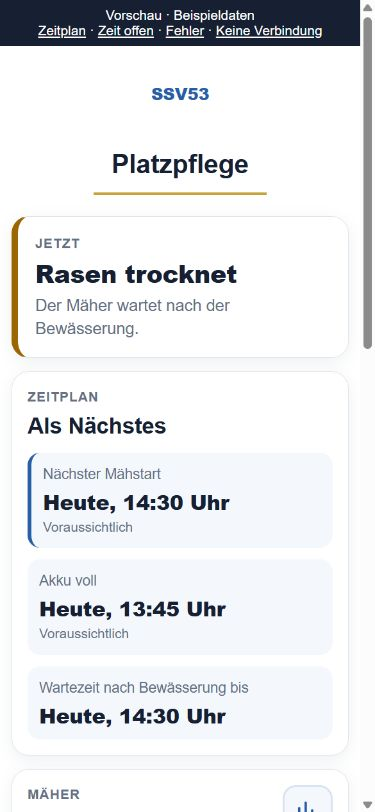

# Einfache Platzpflege-Anzeige

Die App zeigt zuerst den aktuellen Zustand und danach die nächsten Uhrzeiten.
Fehler nennen eine konkrete Handlung. Technische Diagnosebegriffe und rohe
Herstellermeldungen erscheinen nicht mehr in diesen Anzeigen.

**Entwickelt und getestet, noch nicht veröffentlicht oder installiert.**
Diese Überarbeitung ersetzt den UI-Vorschlag aus dem ursprünglichen Audit
und gehört zu [Entwicklungs-PR 47](https://github.com/Rohdeo87/ssv53-heimspiele/pull/47).

## Ansicht

- **Jetzt:** beispielsweise „Rasen trocknet“ oder „Mäher braucht Hilfe“.
- **Als Nächstes:** nächster Mähstart, erwarteter voller Akku und Ende der
  Wartezeit nach Bewässerung. Prognosen tragen „Voraussichtlich“.
- **Mäher, Bewässerung und Platzbelegung:** jeweils eine eigene Karte.
  Terminzeit und tatsächliche Platzsperre werden unterschieden.
- **Bedienung bei Bedarf:** Schnitthöhe und einzelne Zonen lassen sich aufklappen.
  Statistiken bleiben über die vorhandenen Schaltflächen erreichbar.
- **Unbekannte Zeit:** „Noch offen“. Ein Verbindungsausfall lässt keine alte
  Startuhrzeit als aktuelle Zusage stehen.
- **Fehler:** etwa „Standort nicht gefunden. Bitte am Mäher nachsehen.“ oder
  „Mäherstart nicht bestätigt. Bitte den Mäher vor Ort prüfen. Nicht erneut starten.“

Die [interaktive Vorschau](appack-preview.html) verwendet ausschließlich
Beispieldaten. 13:45 und 14:30 Uhr sind **keine Liveprognosen**. Über die Links
oben lassen sich Zeitplan, unbekannte Ladezeit, Fehler und Verbindungsausfall
prüfen. Netzwerkzugriffe sind gesperrt; Bedienanfragen werden lokal abgewiesen.

Weitere Aufnahmen: [vollständige mobile Ansicht](mobile-full.png),
[Fehler](mobile-error.png), [Verbindungsausfall](mobile-offline.png),
[Bewässerungsplan](mobile-plan.png), [320 Pixel](mobile-320-unknown.png),
[Desktop](desktop-times.png).

## Berechnung und Grenzen

Der nächste Mähstart berücksichtigt Ladeende, Backend-Freigabezeit, Belegung
einschließlich Parkvorlauf und ausreichend lange Mähfenster. Die Darstellung
rundet auf fünf Minuten auf. Manueller Stopp, ungeklärte Startwirkung,
fehlende Zustandsdaten, Fehler, unbestätigte Planänderung und fehlender
Automatikbesitz verhindern eine konkrete automatische Startprognose. Bei einem
geparkten Mäher wird auch die vom Backend gemeldete Akkugrenze berücksichtigt.
Diese Anzeige erteilt keine Gerätefreigabe; die Controllerprüfungen bleiben bestehen.

Das Ladeende wird aus mindestens drei vergleichbaren abgeschlossenen
Ladeabschnitten an zwei Tagen geschätzt. Diese müssen bereits zum **ersten
beobachteten Ladepunkt** passen. Der erste Punkt bleibt der Anker; die längste
beobachtete Restdauer wird verwendet. Es gibt keine angenommene
Prozent-pro-Minute-Laderate. Bei überschrittener Prognose, Stillstand, Fehlern,
Datenlücken oder fehlender Vergleichsbasis steht „Noch offen“.

Die Berechnung verwendet dieselbe vorhandene Statistikabfrage und den frischen
Akku jeder Statusantwort. Keine zusätzliche Herstellerabfrage oder
Geräteaktion entsteht. Historische Ladekurven bleiben im Statistikcache;
technische Nachweisfelder sind im Backend prüfbar, erscheinen aber nicht in der UI.

Der private Siebentagesexport enthält zwölf Ladeabschnitte. Vier erfüllen die
strenge zeitliche und inhaltliche Qualitätsprüfung. Bei niedrigem Startakku
reichen die Vergleiche häufig noch nicht. Im kleinen Export fehlen Geräte-ID
und Verbindung; er belegt keine Liveprognose für ein bestimmtes Gerät. Die
reguläre Abfrage projiziert diese bereits geloggten Felder zusätzlich.
Bei fehlender Gerätezuordnung bleibt die Prognose unbekannt.

Nachträglich ergänzte oder korrigierte Historie kann eine Schätzung verändern.
Eine angezeigte Prognose wird nicht dauerhaft gespeichert. Das bloße Entfernen
alter Vergleiche kann den fest verankerten Zeitpunkt höchstens vorziehen oder
entfallen lassen. Die Genauigkeit wurde noch nicht im Parallelbetrieb gemessen.

## Nachgewiesene Korrekturen

| Problem | Korrektur und Nachweis |
| --- | --- |
| Startprognose trotz 25 % Akku bei 90-%-Grenze | Zeitpunkt bleibt offen; Regressionstest |
| Ladeprognose erschien nach Mitternacht mit späterem Anker erneut | Erster Ladepunkt bleibt fest; Modellrekonstruktion nach Kohortenwechsel getestet |
| Formular und Bestätigung zeigten auf fremder Gerätezeitzone unterschiedliche Zeiten | Durchgängig Berliner Zeit; UTC/Berlin/US-Zeitzonen und Sommerzeitwechsel getestet |
| Abgewiesene Wasseränderung erschien noch als laufende Bestätigung | Roter Prüfhinweis, auch bei gleichzeitigem manuellen Stopp |
| Laufendes Wasser wurde als bloße Planänderung erklärt | Aktuelle Bewässerung erhält Vorrang |
| Vorbereitung behauptete Stationsaufenthalt trotz Heimfahrt | Zum Abwarten auffordern, keine vorzeitige Bestätigung |
| Verbindungsausfall ließ alte Startzeiten stehen | Zeiten offen, Geräte als nicht aktuell markiert, Bedienung gesperrt |
| Terminzeit verdeckte abweichende Sperrzeit | Zusätzliche Platzsperre; Ende an einem anderen Tag erhält sein Datum |

## Prüfung und Einführung

Lokal bestanden **739 Python-Tests und 406 Untertests sowie 88 Appack-Tests**.
[Prüf- und Freigabeprotokoll](testing-and-release.md),
[Appack-Testergebnis](appack-tests.xml) und [Versions-/Paketnachweis](delivery.json)
trennen Entwicklung, Build und Einführung. Zwei unabhängige Reviews fanden
Randfälle; die gezielten Nachprüfungen bestätigten die Korrekturen.

**Nächster Freigabeschritt:** diese Ansicht abnehmen. Vor einer Veröffentlichung
müssen Backend und Appack-Template als kompatibles Versionspaar nachgewiesen
werden. Das frühere Audit-Paket enthält diese Ladeprognose noch nicht.
Das Einspielen in Appack und die Bereitstellung des passenden Backends benötigen
eine gezielte Freigabe. Die Bedingungen des
[Audit-Einführungsplans](../audit-2026-09-09/rollout-and-operations.md) bleiben bestehen.
Es gibt keinen Nachweis eines Livepiloten oder zusätzlichen Mähzeitgewinns aus
dieser reinen Anzeigeverbesserung.
