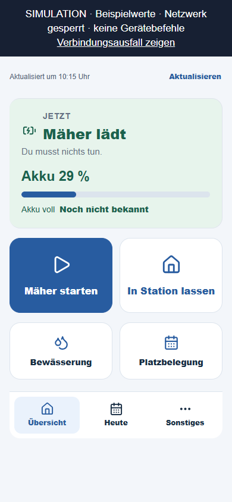
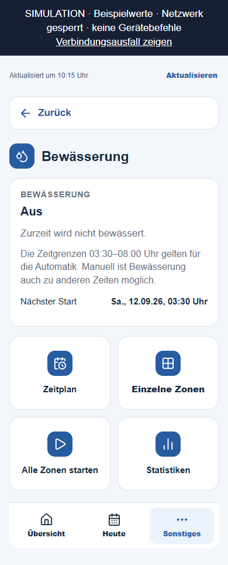
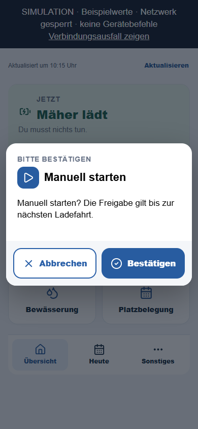
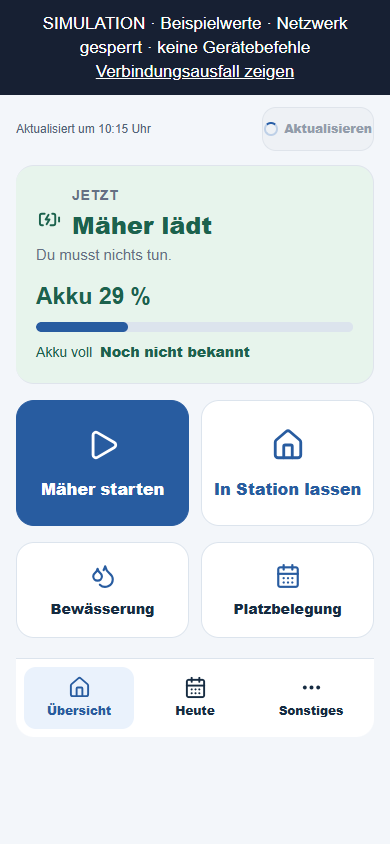

# Ladeanzeige und Bedienflächen korrigieren

Stand 11.09.2026: entwickelt und offline geprüft. Veröffentlichung und
unabhängiges Review werden nach Durchführung unten ergänzt.

## Nachgewiesene Ursachen und Änderung

| Rückmeldung | Ursache | Änderung |
|---|---|---|
| 29 % geladen, Laden nicht erkennbar | Die allgemeine Entscheidung `MOWER_BATTERY_CHARGING` wurde vor der tatsächlichen Aktivität `CHARGING` angezeigt. Der Akkustand lag nach der Umgestaltung nur in einem Untermenü. | Aktuelle Ladung heißt „Mäher lädt“. Akkustand und Ladebalken stehen auf der Übersicht, auch zusätzlich zu einer wichtigeren Rasenpause oder Belegung. |
| Mehrere große „Noch offen“-Felder | Fehlende Ladeprognose wurde sowohl als unbekannter Start als auch als separates unbekanntes Ladeende betont. | Während bestätigter Ladung entfällt die große unbekannte Startkachel. Das Ladeende bleibt kompakt als unbekannt erkennbar; vorhandene Schätzungen und andere relevante Planungszustände bleiben sichtbar. |
| Verschiedene Bewässerungsbuttons | Allgemeines `.btn` entfernte bei Aktionskacheln die blaue Iconfläche. Navigation verwendete fetten Text, übernommene Buttons normalen Text. | Einheitliche Iconflächen, Schriftstärken und ausdrückliche Beschriftungselemente. |
| Beschriftung/Dialog nicht sauber zentriert | Text lag als anonymer Flex-Inhalt neben großen Icons; schmale Dialogspalten hatten keine ausreichende Begrenzung. | Eigene Text-Spans, zentrierte Kacheln, kleinere Dialogicons, begrenzte Spalten und passende Innenabstände. |
| Unruhiges Aktualisieren | Der Button wechselte zu „Daten werden geladen“ und änderte dadurch seine Breite. | „Aktualisieren“ bleibt stehen; kleiner reservierter Ladeindikator und `aria-busy`, keine Überlagerung und keine verdrängten Statusdaten. |
| Doppelter Header | Wappen und Seitentitel wurden zusätzlich zum nativen Appack-Header dargestellt. | Zusätzlichen Header aus der Vorlage entfernt. |

Es werden ausschließlich die Darstellung und Browserprüfungen geändert.
Backendfreigaben, Akkugrenzen, Geräteaktionen, Bewässerungsfenster und die
Reihenfolge wichtigerer Konfliktmeldungen bleiben unverändert. Ein geparkter
Mäher gilt nicht allein wegen einer Akkusperre als ladend. Alte, fehlende oder
fehlerhafte Gerätemeldungen erzeugen keine aktuelle Ladeanzeige.

Eine Ladeuhrzeit wird weiterhin nur aus der vorhandenen belastbaren Schätzung
übernommen. Der Schätzer verlangt mehrere vergleichbare abgeschlossene
Ladeabschnitte und ausreichende aktuelle Messpunkte. Ein einzelner Akkustand
wie 29 % reicht für eine seriöse Uhrzeit nicht aus. Es wurde kein Endzeitpunkt
erfunden und kein Schutzkriterium des Schätzers gelockert.

## Prüfnachweise und Ansichten

- [160 Appack-Tests erfolgreich](node-tests.txt), einschließlich des exakten
  gemeldeten Falls mit 29 %, echter Akkusperre und fehlender Ladeprognose.
- [21 Browserkombinationen](browser-check.json): sieben Zustände bei 320,
  390 und 768 Pixel Breite. Kein Überlauf, keine JavaScript-Fehler.
- Zusätzliche Prüfung des verzögerten Aktualisierens: Beschriftung und Breite
  bleiben gleich, Ladestatus bleibt sichtbar, kein Dialog öffnet sich.
- Vier Bewässerungskacheln besitzen identische Schrift-/Iconstile;
  Bestätigungsbuttons halten Icon und Text innerhalb ihrer Begrenzung.
- HTML, CMS-Kopierfassung und Designquellen synchron; `git diff --check` bestanden.
- Netzwerk in den Browserprüfungen gesperrt, keine Gerätebefehle.

Die folgenden Bilder zeigen ausdrücklich **synthetische Daten**, keine
neuen Gerätemeldungen des realen Mähers:

Reproduktion: `SSV53_UI_OUTPUT=docs/ui-2026-09-11/ladeanzeige-korrektur`
für `python -m scripts.build_wunschdesign_preview` und
`node scripts/capture_wunschdesign.cjs` setzen. Die vorhandenen bisherigen
Releaseaufnahmen werden dadurch nicht überschrieben.

Für die Veröffentlichung wird nur `Platzpflege.tpl` nach Sicherung und
Inhaltsvergleich ersetzt. Keine Azure-Neuveröffentlichung erforderlich.
Anschließend gespeicherten Quelltext und ausgelieferte Designblöcke erneut
vergleichen. Rückfall: vorherige gesicherte Vorlage wiederherstellen.
