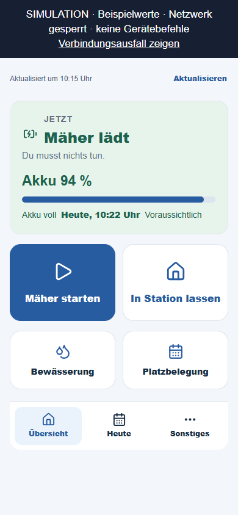
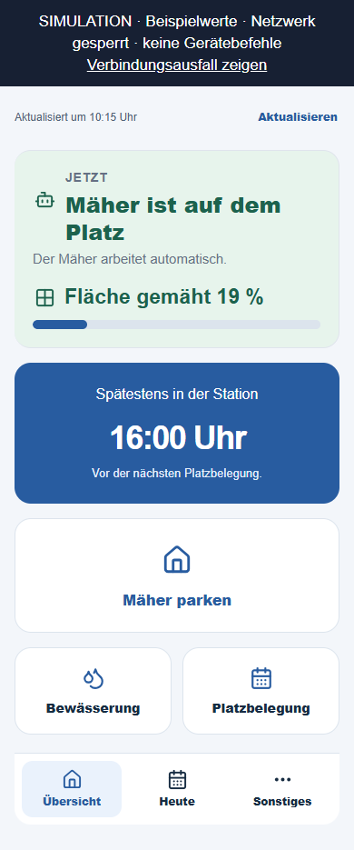

# Ladeende und Flächenfortschritt

Stand 11.09.2026: entwickelt, geprüft, mit PR 75 zusammengeführt und nach
ausdrücklicher Zustimmung installiert. Appack-Oberfläche um 14:01 Uhr (Berlin)
gespeichert; neue Azure-Version ab 14:40 Uhr in den Steuerungszyklen nachgewiesen.
**Flächenanzeige und neue Ladeprognose sind veröffentlicht.** Alle 70 Paketdateien
wurden mit der Installation verglichen; 16 Funktionen vorhanden, 17 geprüfte
Steuerungseinstellungen unverändert. Keine Geräte-Testbefehle. Ein vollständiger
Ladevorgang nach der Installation wurde noch nicht beobachtet.

## Nachgewiesene Ursache

Lesender Abruf von 9.732 Produktionszyklen über sieben Tage. Die bisherige
Berechnung fand vier fehlerfreie abgeschlossene Ladeabschnitte. Nur zwei
deckten den heutigen Start bei 9 % ab (05.09.: etwa 51 Minuten; 09.09.: etwa
50 Minuten). Sie verlangte mindestens drei. Deshalb blieb die Uhrzeit auch
bei 94 % leer. Um 13:40 Uhr war eine Batteriemeldung 182 Sekunden alt; dadurch
wurde zusätzlich der gesamte aktuelle Ladeabschnitt dauerhaft ausgeschlossen.

Die [Wiederholung der heutigen Meldungen](replay.json) ergibt für 13:38 Uhr
(94 %) und 13:41 Uhr (99 %) jetzt jeweils **13:45 Uhr, voraussichtlich**.
Dies ist eine nachträgliche Wiederholung, keine damals ausgespielte Prognose.
Ein direkter lesender Herstellerabruf um 13:45:39 Uhr meldete 100 % und MOWING.

## Änderung und Grenzen

- Die [offizielle Husqvarna OpenAPI-Dokumentation](https://developer.husqvarnagroup.cloud/apis/automower-connect-api)
  beschreibt `battery.remainingChargingTime` als Restzeit in Sekunden. Null
  kann fehlende Modellunterstützung bedeuten. Dieses Feld wurde bislang beim
  Einlesen verworfen. Es wird nun übernommen und bei aktueller fehlerfreier
  Ladung als bevorzugte Anzeigeprognose verwendet. Anker ist der Zeitstempel
  der Meldung, nicht jeder neue Seitenabruf. Null wird nicht als Ladeende ausgegeben.
- Wenn keine positive Herstellerzeit vorliegt, verwendet ausschließlich die
  Anzeige zwei vergleichbare, vollständig bestätigte Ladeabschnitte an zwei
  Tagen. Es gibt keine pauschale Prozent-pro-Minute-Hochrechnung.
- Eine kurz verzögerte frühere Meldung bis 300 Sekunden verwirft nicht mehr
  die Anzeige für den gesamten Ladeabschnitt. Der ursprüngliche Ladestart
  bleibt erhalten. Fehlende Zyklen, Rückschritte, Fehler und längere Lücken
  verhindern die Prognose. Die aktuelle Meldung muss weiterhin höchstens
  180 Sekunden alt sein. Historische Vergleichsladungen bleiben streng geprüft.
- Die Uhrzeit aus dieser Anzeige wird nicht an die Bewässerungsplanung
  weitergegeben. Deren bestehende Berechnung mit drei Vergleichsladungen bleibt
  unverändert. Auch eine nächste Startzusage wird nicht aus der neuen Uhrzeit
  abgeleitet. Abgelaufene empirische Prognosen werden nicht nach hinten verschoben.
- Auf der Übersicht erscheint beim aktuellen Mähen „Fläche gemäht 19 %“ mit
  Flächensymbol und Fortschrittsbalken. Werte kommen direkt aus dem gemeldeten
  Arbeitsbereich, nicht aus einer alten Statistik. Bei Heimfahrt, Laden,
  veralteten Meldungen oder Gerätefehlern wird kein aktueller Mähfortschritt behauptet.

Der Herstellerabruf erfolgte nach Abschluss der Ladung und enthielt Restzeit 0.
Eine positive Hersteller-Restzeit dieses Geräts ist deshalb noch nicht live
nachgewiesen. Der vorhandene empirische Ersatz wurde mit den Betriebsdaten
reproduziert. Fehlende geeignete Daten bleiben als unbekannt erkennbar.

## Prüfung

- Neue Regressionen für Sekunden/Zeiteinheit, unveränderte Uhrzeit beim
  Aktualisieren, Null/fehlende/ungültige Werte, aktuelle und vergangene veraltete
  Meldungen, Lücken, Fehler, Unterbrechungen, Neustart und abgelaufene Prognose.
- Separate Anzeigeprognose darf weder bestehende Startzeit noch Freigaben ändern.
- 163 Appack-Tests; 24 Browserkombinationen (8 Zustände, 320/390/768 Pixel).
- Zwei begrenzte Aufgaben mit Luna: Flächenanzeige implementiert und anschließend
  Ladeprognose unabhängig geprüft. Ein Hinweis auf ungültige numerische
  Eingaben wurde behoben und abgesichert. Die absichtlich strengere aktuelle
  Datenprüfung bleibt erhalten.
- [Python-Gesamtlauf](python-tests.txt): 1.451 Tests und 482 Subtests erfolgreich.
  Erster Lauf hatte 170 Fixture-Fehler durch ein nicht beschreibbares Windows-
  Tempverzeichnis. Mit eigenem Tempverzeichnis im Workspace vollständig bestanden.
- CI des exakten Kopfes `6d0e8d1ed665f011a28594d418f2e4f283d7deda` erfolgreich:
  [Code](https://github.com/Rohdeo87/ssv53-heimspiele/actions/runs/34596389265),
  [Paket](https://github.com/Rohdeo87/ssv53-heimspiele/actions/runs/34596389129).
  [PR 75](https://github.com/Rohdeo87/ssv53-heimspiele/pull/75), Merge
  `2e964c799c1674e5f6b1d2e7097566857389d220`; relevante Quellen bytegleich zum geprüften Kopf.
- [Exakter Paketnachweis](package-proof.json): 69 Git-Quelldateien und Manifest,
  16 Funktionen, isolierter Import ohne Netzwerk erfolgreich. Paket
  `dist/ladeprognose-fortschritt-release.zip`, SHA-256
  `d2ce753a5a7552fdad5d3760cf804f9632ee017ddb2c9a705837e620803b771b`.
- [Installation vorher](installation-before.json): Host Running, 16 Funktionen,
  weiter bisheriges Manifest `99b6bd5aeaaba42d3b2f25831acdd86e80d64f5101bf9cfb9f66c27c790bcd27`.
  [Betriebszustand vor geplanter Installation](controller-before.json): Mähen,
  Fehlercode 0, keine aktive Bewässerung, keine aktuelle Platzsperre. Diese
  Vorabprüfung wurde unmittelbar vor der genehmigten Installation mit
  [Installation](installation-predeploy.json) und
  [Gerätezustand](controller-predeploy.json) erneut durchgeführt.
- [Appack-Nachweis](appack-publication.json): nach vollständigem Neuladen
  kompletter Editorinhalt gleich zur geprüften Vorlage; CSS und JavaScript am
  Render-Endpunkt ebenfalls gleich, Flächenanzeige im DOM vorhanden, keine
  Konsolenfehler. Die native Handy-Sitzung wurde nicht geprüft.

## Installation und anschließender Betrieb

- [Deployment-Rückmeldung](deployment-result.json): erfolgreiche Installation.
  Der zuvor blockierte Versuch wurde erst nach der konkreten Nutzerzustimmung
  erneut ausgeführt. Das Paket selbst blieb unverändert.
- [Installationsvergleich](installation-after.json): Host Running, 16 Funktionen,
  70 von 70 Dateien bytegleich zum geprüften Paket; 17 verglichene Einstellungen
  unverändert. Neues Manifest:
  `0dd0c5a15b45e4b3eca7b3c334bcc4cc478edcaaf6ede7ca791eb30f8c85d291`.
- [Steuerungszyklen](controller-after-final.json), Abruf 14:48 Uhr: acht Zyklen
  mit neuem Manifest von 14:40 bis 14:47 Uhr. Über das erfasste Zeitfenster ab
  14:29 Uhr betrug der größte Abstand 63,08 Sekunden; kein ausgelassener
  Minutentakt erkennbar. Durchgehend MOWING, Fehlercode 0, aktuelle Wasserdaten,
  keine laufende Bewässerung. Dies ist beobachtete Telemetrie, kein Vor-Ort-Test.
- [Hostprüfung](host-shutdown-correlation.json), Abruf 14:49 Uhr: 14 Meldungen
  `python exited with code 143` seit Installation. Alle 14 korrelieren innerhalb
  von zehn Sekunden mit `Stopping JobHost` derselben Instanz. Vergleichbare
  Meldungen gab es bereits vorher ([Zeitverlauf](host-lifecycle-review.json)).
  Sämtliche erfassten Funktionsaufrufe erfolgreich, darunter neun Mäher-Timer
  und sechs Statusabfragen. Kein Anwendungsausfall in dieser Stichprobe
  nachgewiesen; der genaue Plattformauslöser der Hostabschaltungen bleibt offen.

Die historischen Dateien `appack-publication.json` und `installation-before.json`
beschreiben ihren damaligen Prüfzeitpunkt; der jetzt gültige Installationsstand
steht in `installation-after.json` und [release-summary.json](release-summary.json).
Eine positive Hersteller-Restzeit und die angezeigte Schätzung beim nächsten
realen Laden bleiben als Live-Abnahme offen. Der aktuelle Flächenwert wurde in
Browserprüfungen und die Auslieferung der Oberfläche am Appack-Endpunkt geprüft;
eine erneute Abnahme auf dem Handy steht aus.

Die Bilder verwenden **synthetische Daten**:

Reproduktion: `SSV53_UI_OUTPUT=docs/ui-2026-09-11/ladeprognose-fortschritt`
für `python -m scripts.build_wunschdesign_preview` und
`node scripts/capture_wunschdesign.cjs` setzen.

Rückfall: vorheriges Azure-Paket `dist/platzpflege-wunschdesign-release.zip`
und die vor Veröffentlichung gesicherte Appack-Vorlage. Keine Steuerungsparameter
ändern; vor einem Hostneustart tatsächliche Geräte-/Wasserzustände kontrollieren.
