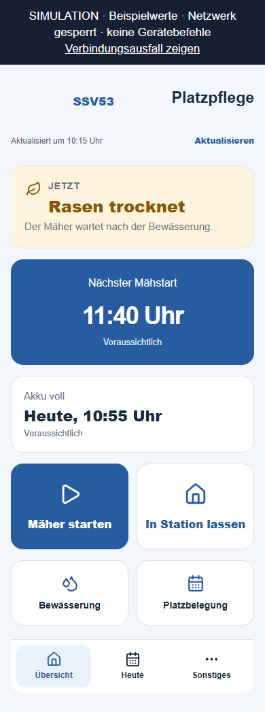
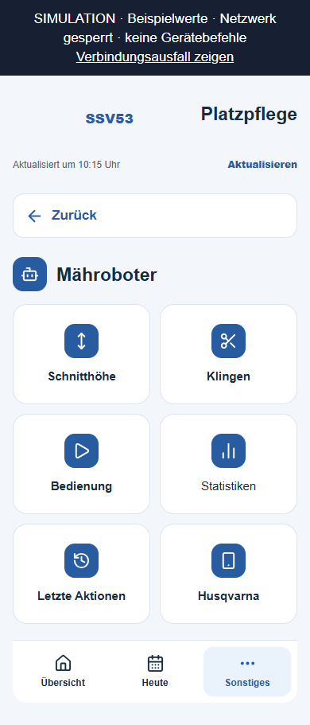
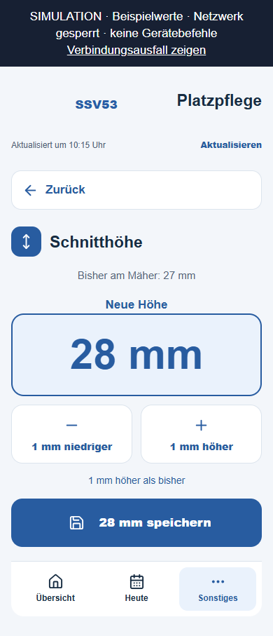
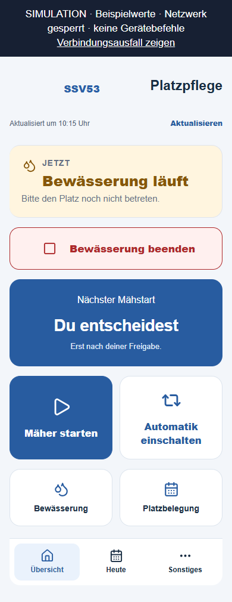
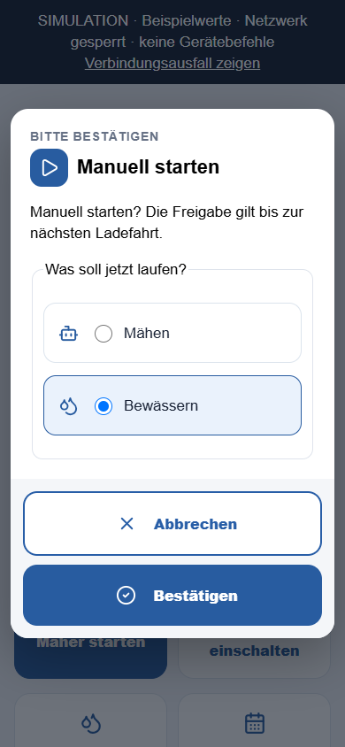
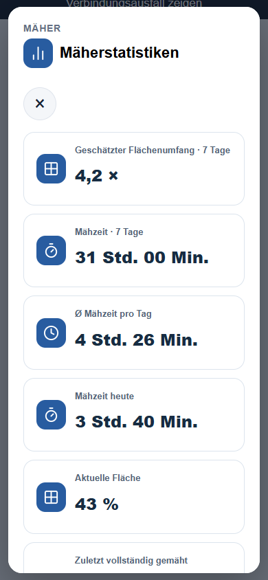

# Platzpflege: Umsetzung des gewählten Designs

Stand: 11.09.2026. **Entwickelt, offline geprüft und nach ausdrücklicher Freigabe veröffentlicht.**

Azure-Installation, gespeicherte Appack-Vorlage und ausgeliefertes Design wurden
geprüft. Sechs Produktionszyklen zeigen Heimfahrt und Laden. Gerätebedienung
und vollständiger Bewässerungszyklus bleiben vor Ort zu bestätigen.
[Veröffentlichung mit Nachweisen](release/README.md).

## Vereinbarte Gestaltung

Status aus Entwurf 1, große nächste Uhrzeit aus Entwurf 2, große Bedienflächen
aus Entwurf 6; abgerundete Iconflächen aus Set C in der Vereinsfarbe aus Set B.
Die erste Seite zeigt den aktuellen Zustand, die nächste belastbare Zeit und
passende Aktionen. Weitere Funktionen liegen in Mähroboter, Bewässerung,
Platz & Training und Vereinsheim. Icons werden lokal eingebettet und bis in
Dialoge, Zonen, Eingaben und Statistiken verwendet.

Die neue Schnitthöhe wird groß dargestellt. Der bisher bestätigte Wert bleibt
getrennt sichtbar. Eine Auswahl verändert noch nicht den gemeldeten Gerätewert.
Speichern erscheint erst bei einer möglichen Änderung; die Bestätigung nennt
die gewählte Millimeterzahl. Die bestehende Anmeldung wird wiederverwendet.

Korrektur nach Nutzerhinweis: Das Statusicon folgt derselben priorisierten
Meldung wie die Überschrift. „Rasen trocknet“ zeigt ein Blatt, selbst wenn der
Mäher gleichzeitig lädt. Batterie, Tropfen, Kalender und Warnzeichen gehören
jeweils zu Lade-, Bewässerungs-, Belegungs- und Fehlermeldungen. Der Wechsel
von Rasenpause zu Laden wurde zusätzlich ohne Neuladen der Seite geprüft.

## Tatsächliche Ansichten

Die folgenden Aufnahmen stammen aus der geänderten Appack-Vorlage, mit
ausdrücklich synthetischen Daten und gesperrtem Netzwerk. Sie sind keine
Aufnahmen der veröffentlichten App und kein Gerätenachweis.

| Übersicht | Mähroboter | Neue Schnitthöhe |
|---|---|---|
|  |  |  |

| Laufende Bewässerung | Auswahl bei Konflikt | Statistiken |
|---|---|---|
|  |  |  |

[Interaktive Offline-Ansicht](appack-preview.html) ·
[Bewässerungsplan](water-plan-390.png) · [Trainingsplan](training-390.png).
Die Fragmentwerte `#charging`, `#parked`, `#mowing`, `#stale`, `#watering` und
`#unconfirmed` wählen Beispielsituationen; nach einem Wechsel neu laden.

## Funktionszuordnung und Schutz

| Funktion | Zugang / Verhalten |
|---|---|
| Aktueller Zustand, nächster Start, erwartetes Ladeende | Übersicht; Schätzungen bezeichnet, unbekannte Zeiten bleiben offen |
| Start, Parken, Automatik freigeben | Übersicht und Mähroboter → Bedienung; backendseitige Berechtigungen bleiben maßgeblich |
| Parken während einer Startsperre | Eigene Freigabe bleibt wirksam; keine gemeinsame Sperre mit Start |
| Bewässerung beenden | Bei zulässigem Stopp in allen Unterseiten erreichbar; sofort / nach aktueller Zone |
| Schnitthöhe und Klingenwechsel | Mähroboter; bestehende Bestätigungen und Geräteantworten |
| Bedienung am Gerät / über Husqvarna | Mähroboter → Husqvarna; bestehende Vorbereitung und Bestätigung |
| Mäherstatistiken und letzte bekannte Geräteanfragen | Mähroboter; keine erfundenen Verlaufsdaten |
| Gesamtlauf und sieben Einzelzonen | Bewässerung; bisherige Stations-, Belegungs-, Frische- und Ablaufprüfungen |
| Nächster automatischer Lauf, Pause, Aussetzen, Änderung | Bewässerung → Zeitplan; passende große Schaltflächen |
| Wasserstatistik und Datenfehler | Bewässerung; fehlerhafte Daten weiter erkennbar |
| Belegung und vollständiger Kalender | Heute / Platz & Training; drei interne Links zum bestehenden Appack-Modul |
| Training verschieben | Platz & Training → Training verschieben; vorhandene Kalenderrechte und eigene Termine gelten weiter |
| Wintertrainingsplan | Platz & Training → Trainingsplan; bisheriger bestätigter Wirksamkeitszeitpunkt |
| Vereinsheimtermine | Sonstiges → Vereinsheim |

Die Umsetzung verschiebt vorhandene DOM-Elemente mit ihren ursprünglichen
IDs und Ereignisbehandlungen. Die Gestaltung erteilt keine Backendfreigaben.
Beim Konflikt Mähen/Bewässern erscheint die Trockenheitsbestätigung nur für
die Wahl Mähen; die bestehende serverseitige Bestätigungsprüfung bleibt bestehen.
Die vorhandenen Zugriffsrollen und der Trainer-Endpunkt wurden nicht geändert.

## Fehlerursache und Zeitregel der Bewässerung

Der manuelle Start wurde bisher zweimal am Automatikfenster 03:30–08:00
abgewiesen: bei der Anfrageannahme und unmittelbar vor dem Zonenstart.
Zusätzlich klassifizierten Controller und Anzeige auch einen vorgesehenen
manuellen Lauf außerhalb dieser Zeit als fehlerhaft.

Jetzt gilt das Zeitfenster ausschließlich für automatische Abläufe. Explizite
App-Anfragen für alle Zonen oder eine einzelne Zone dürfen außerhalb dieses
Fensters angenommen und sicher ausgeführt werden. Der Controller erkennt sie
an einem vollständig persistierten, mit SHA-256 geprüften Plan mit ausschließlich
`operator_manual: true`. Er prüft die vollständige konfigurierte Relay-Liste.
Bei schon laufendem Wasser muss zusätzlich genau das aktuelle ausgewählte
Relay in einer aktiven Ausführungsphase nachgewiesen sein. Ein abgeschlossener
manueller Plan rechtfertigt keinen neuen fremden Lauf.

Die Statusantwort enthält dafür `irrigation.intent`. Nur eine verifizierte
manuelle Herkunft in einer laufenden Phase nimmt die Uhrzeitwarnung in der
Anzeige aus. Fehlende Herkunft, ein falsches aktives Relay, ein gemischter Plan,
eine abgelaufene Phase und unbekanntes Wasser bleiben konservativ behandelt.
Ein Mäher-Wasser-Konflikt wird unabhängig davon weiter als dringlich angezeigt.

Eine Startanfrage ist weiterhin keine Zusage eines sofortigen Ventilstarts.
Stationsnachweis, Datenfrische, Belegung, native Plansperren, Idempotenz,
Befehlsreihenfolge und die Rasenpause nach dem tatsächlichen Wasserende gelten
weiter. Das Zeitfenster kann außerdem nicht durch das Bearbeiten eines
automatischen Plans umgangen werden. Für direkt am Hydrawise-Gerät ausgelöste
Läufe wird ohne zuordenbaren Auftrag keine manuelle Herkunft erfunden.

**Abgrenzung zum Gesprächsentwurf:** Eine neue Bewässerungsausnahme trotz
eingetragener Belegung wurde nicht eingeführt. Die geltenden Backendregeln
bleiben maßgeblich; die Änderung erlaubt zusätzliche Uhrzeiten, keine neuen
Ausnahmen von Platzsperren. Eine solche Ausnahme bräuchte einen eigenen,
serverseitig abgesicherten Bestätigungsvertrag.

## Nachweise und Prüflücken

| Stufe | Ergebnis |
|---|---|
| Repository vor Änderung | Sauberer Stand `913253a`, Basis `feature/azure-mower-migration`; neuer Branch `feat/platzpflege-wunschdesign-20260911` |
| Bisher installierter Backendstand | Am 11.09.2026, 09:19 UTC: Host Running, 16 Functions; alle Paketdateien stimmen mit dem vorherigen ZIP überein. [Protokoll](installation-before.json) |
| Entwicklung | Dashboard HTML/TXT, lokale Gestaltungsquellen, manueller Zeitvertrag im Backend, Tests und CI-Abgleich |
| Python | **1.418 Tests, 482 Unterfälle bestanden**, Netzwerk in Tests gesperrt. [Protokoll](python-tests.txt) |
| Appack-JavaScript | **158 Tests bestanden**, einschließlich Rechte, Parken, Ladezeiten, Anfragen, Sichtbarkeit und zusammenpassender Statusicons. [Protokoll](node-tests.txt) |
| Browser | **18 Kombinationen**: sechs Zustände × 320/390/768 Pixel; Navigation, Höhenwahl, Konfliktauswahl, Statistiken, Stoppen-Dialog, automatische Planung; keine JS-Fehler und kein horizontaler Überlauf. [Protokoll](browser-check.json) |
| Unabhängige Reviews | Getrenntes Backend- und UI-Review. Zu breite Ausnahme für fremdes Wasser korrigiert und getestet; fehlender Kalenderzugang ergänzt |
| Gebautes Artefakt | Neues FULL_FAILSAFE-Quellpaket, 70 Dateien; kein Deployment. [Manifest und Hash](package-manifest-build.json) |
| Veröffentlichung / Geräteverhalten | **Veröffentlicht und Installation geprüft**; sechs Zyklen der neuen Version mit Heimfahrt/Laden beobachtet. Keine Testbefehle, kein vollständiger Wasserzyklus und kein zusätzlicher Mähzeitgewinn live nachgewiesen; [Releasebericht](release/README.md) |

Der erste vollständige lokale Python-Lauf scheiterte am Zugriff auf das
bestehende temporäre pytest-Verzeichnis. Nach freigegebenem Zugriff bestand
die vollständige Suite. [Ursprüngliche Umgebungsfehlermeldung](python-first-error.txt).

Offen: Test des internen Kalenderlinks in der installierten Appack-App,
Bildschirmleser und reale WebView-Versionen, erneute Anmeldung nach Ablauf im
Handytest, Bestätigung einer tatsächlichen Höhenänderung sowie überwachter
manueller Wasserlauf außerhalb des Morgenfensters. Diese Offline-Abnahme ist
kein Ersatz für diese Geräte- und Anwendungstests.

Die Kalender-Modul-ID `ssv53_TextImage_1761902353516` stammt aus dem
angemeldeten CMS. Appack dokumentiert interne Navigation über `nav://` plus
technischem Modulnamen: [Herstellerdokumentation](https://docs.appack.de/module/event-modul/).
Dies ist kein Nachweis einer öffentlichen OS-URL-Registrierung. Die Icons
folgen der [Lucide-Lizenz](https://lucide.dev/license); der Lizenztext liegt
zusätzlich im Repository und im eingebetteten Template.

Der [Paketvergleich](package-comparison.json) enthält alle Byteunterschiede:
Die meisten stammen ausschließlich von Windows-Zeilenenden. Nach deren
Normalisierung unterscheiden sich nur `mower/full_failsafe.py`,
`platzwart_console.py` und das Paketmanifest. Für einen späteren Installations-
nachweis ist der tatsächliche neue Pakethash maßgeblich, nicht dieser
normalisierte Inhaltsvergleich.

## Reproduzieren und warten

```powershell
python scripts/sync_platzpflege_design.py
python scripts/sync_platzpflege_design.py --check
python -m pytest -q tests
node --test tests/test_appack*.js
python -m scripts.build_wunschdesign_preview
node scripts/capture_wunschdesign.cjs
python scripts/build_azure_full_failsafe_package.py --output dist/platzpflege-wunschdesign-full-failsafe.zip
```

Die Browserprüfung benötigt Playwright und einen verfügbaren Edge. In dieser
Arbeitsumgebung wurde das bereits installierte Playwright über `NODE_PATH`
verwendet; es wurde keine neue Laufzeitabhängigkeit der App eingeführt.
Gestaltungsänderungen erfolgen in `ui/platzpflege/design.js` und `design.css`.
Der Sync-Befehl aktualisiert die eingebetteten Blöcke sowie die identische
CMS-Kopierfassung. CI prüft, dass keine Quelle vergessen wurde.

## Risiken, Einführung und Rückfall

| Risiko | Erkennung und Begrenzung | Rückfall |
|---|---|---|
| UI versteckt notwendige Bedienung | Getrennte Start-/Parkregeln, globaler Wasserstopp, Browser- und Unit-Tests; Handyprobe vor Freigabe | Vorherige gesicherte CMS-Vorlage wiederherstellen |
| Fremdes Wasser wird als manueller Auftrag angesehen | Persistierte Planidentität, vollständige Zonen, aktuelles Relay und aktive Phase geprüft; negative Regressionen | Keine Freigabe aus fehlender Herkunft; Anlage und Auftrag vor Ort klären |
| Gemischte alte/neue Backend- und UI-Version | Backend zuerst veröffentlichen und Dateihashes nachweisen, dann passende Vorlage speichern | UI und Backend gemeinsam auf bekannte Version zurückführen; aktive Wasserphase vorher prüfen |
| Kalenderlink funktioniert im Handy nicht | Originales Modul statt neuer Kalenderlogik; native Navigation vor Freigabe testen | Bestehenden Appack-Menüeintrag Platzbelegung weiter nutzen; Link korrigieren |
| Veraltete Anzeige / verlorene Befehlsantwort | Bestehende Frische- und Bestätigungsregeln; keine optimistische Gerätebestätigung | Zustand prüfen, keine unbestätigten Starts wiederholen |

Die Veröffentlichung **dieses geprüften Pakets und dieser CMS-Vorlage** wurde
nach grüner PR-Prüfung und ausdrücklicher Freigabe abgeschlossen, siehe
[Releasebericht](release/README.md). Für künftige Updates gilt: aktuellen Geräte-/Wasserzustand,
aktive Aufträge und bestehende Geräteschedules festhalten. Kein Release während
eines laufenden oder unklaren Bewässerungsauftrags. Nach Backend-Veröffentlichung
Host, Function-Liste, Paketmanifest und installierte Dateien erneut prüfen;
erst danach die gesicherte Appack-Vorlage ersetzen.

Anschließend vor Ort prüfen: interner Kalenderzugang und Trainertermin,
Anmeldung, Start/Parken, manuelle Freigabe, Schnitthöhenbestätigung, ein manueller
Bewässerungslauf außerhalb des Morgenfensters und der nächste automatische Lauf
innerhalb des Fensters. Mindestens ein vollständiger Wasserlauf einschließlich
Rasenpause und ein anschließender Lade-/Mähzyklus sind zu beobachten.

Abbruch bei gleichzeitigem Mähen und Wasser, unbestätigtem Stopp, fremdem Relay,
widersprüchlichen Zeiten oder verlorenen Bedienrechten. Bereits gesendete
Geräteaktionen und native Zeitpläne müssen vor einem Rückfall abgeglichen werden.
Ein Code-Rollback allein ist keine sichere Rückfallmaßnahme: Ein neuer manueller
Lauf außerhalb des Fensters darf nicht durch alten Code mitten im Ablauf als
fremdes Wasser fehlklassifiziert werden. Erst kontrolliert beenden und den
bestätigten Zustand sowie die verbleibende Rasenpause sichern.
