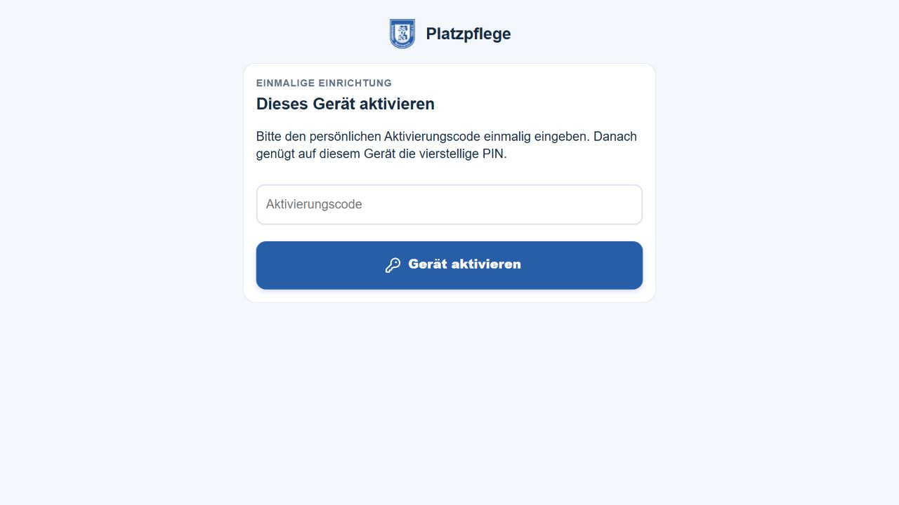

# Veröffentlichung am 11.09.2026: Azure und Appack live

Die neue Version aus [PR #71](https://github.com/Rohdeo87/ssv53-heimspiele/pull/71)
ist veröffentlicht. Die automatische Freigabeprüfung hatte den ersten Versuch
vor der Ausführung abgelehnt. Nach der ausdrücklichen separaten Zustimmung des
Nutzers zu Azure und Appack wurde das Deployment ausgeführt und überprüft.

## Eindeutige Versionskette

| Stufe | Tatsächlicher Nachweis |
|---|---|
| Geprüfter PR-Kopf | `0dfd60af5761c7f518f765cde51c82789bb31e19` |
| Zusammengeführt | `dbefdb8c882ee29747f9c4c3832b633134762174` auf `feature/azure-mower-migration`; Dateibaum identisch zum geprüften Kopf |
| Paket | `dist/platzpflege-wunschdesign-release.zip`; SHA-256 `b0869d0605d5c42f65c5d3947cd57da8b9bd5d76d755f34cee27dc1ac7225308` |
| Paketbau | 69 exakte Git-Quelldateien plus Manifest; isolierter Import registriert 16 Funktionen, Netzwerk gesperrt; [Nachweis](package-proof.json) |
| Azure-Deployment | CLI meldet Erfolg; [Ergebnis](deployment-result.json) |
| Tatsächlich installiert | Host Running, 16 Funktionen, sämtliche 70 Dateien bytegleich zum Paket; [Installationsprüfung](installation-after.json) |
| Schutzkonfiguration | Alle 17 ausgewählten Steuerungs-/Schutzparameter unverändert gegenüber [vorher](installation-before.json); keine eigenen Konfigurations- oder Gerätebefehle beim Update |
| Manifest in laufenden Zyklen | `99b6bd5aeaaba42d3b2f25831acdd86e80d64f5101bf9cfb9f66c27c790bcd27`, erstmals hier um 12:49 Uhr Berlin beobachtet |
| Appack gespeichert | `Platzpflege.tpl`, ID `6a86ab6c4b3c829dd60de9b7`, 11.09.2026 12:50 Uhr Berlin, weiterhin Platzpflege / Belegungsplan_db |
| Appack zurückgelesen | CMS vollständig neu geladen, Quelltext erneut geöffnet und vollständig kopiert: identisch zum freigegebenen Kandidaten nach Zeilenendennormalisierung; [Nachweis](appack-proof.json) |
| Tatsächlich ausgeliefert | Separater Abruf des Appack-Render-Endpunkts: JavaScript- und CSS-Designblöcke identisch; 89 SVG-Icons im DOM, kein Browserfehler in der gelesenen Fehlerliste; [Nachweis](delivery-proof.json) |

Die bereits vor der Zusammenführung erfolgreichen Prüfungen:
[Codeprüfung](https://github.com/Rohdeo87/ssv53-heimspiele/actions/runs/34588761920)
und [Paketprüfung](https://github.com/Rohdeo87/ssv53-heimspiele/actions/runs/34588761937).
Details der lokalen Tests und synthetischen Ansichten stehen im
[Entwicklungsbericht](../README.md). Das Update ist kein erneuter vollständiger
Nachweis aller historischen Projektanforderungen.

## Änderungen im Liveumfang

- Vereinbarte einfache Oberfläche mit klarer Statusmeldung, großer nächster
  Uhrzeit und großen, nach Themen gegliederten Bedienflächen.
- Zusammengehörige Icons auch in Untermenüs, Dialogen und Statistiken.
  Bei „Rasen trocknet“ folgt das Blatt-Icon derselben Priorität wie die Meldung.
- Neue Schnitthöhe deutlich von der zuletzt bestätigten Höhe getrennt;
  vorhandene Anmeldung wiederverwendet, nur sinnvolle Aktionen sichtbar.
- Manuelle Bewässerung ist nicht mehr an das Morgenfenster gebunden.
  Die automatische Bewässerung bleibt an 03:30–08:00 gebunden.
  Bestehende Belegungs-, Stations-, Frische- und weitere Schutzprüfungen bleiben
  wirksam; diese Änderung ist keine allgemeine Freigabe trotz Belegung.
- Persistierte Herkunftsprüfung verhindert, dass unbekannte oder geräteeigene
  Bewässerung pauschal als freigegebener manueller Auftrag behandelt wird.

## Beobachteter Anlagenzustand

Unmittelbar vor dem Update: Mäher mäht, Akku 12 %, Fehlercode 0,
frische Hydrawise-Daten, null aktive Zonen, kein laufender Wasserauftrag und
keine offene Startreservierung. Nächste erfasste Platzsperre um 16:30 Uhr.
[Vorabprüfung](controller-predeploy-final.json).

Sechs Zyklen der neuen Version wurden von 12:49 bis 12:54 Uhr Berlin gelesen:

- 12:49–12:51: Mäher meldet Heimfahrt bei niedrigem Akku.
- Ab 12:52: Mäher meldet Laden; Akku von 9 auf 14 % gestiegen.
- In allen sechs Zyklen: aktuelle Wasserinformationen, null aktive Zonen,
  Fehlercode 0 und kein durch den jeweiligen Controllerzyklus gesendeter Befehl.
- Persistierte Trocknungsfrist blieb 09:40 Uhr Berlin; kein Neustart der
  physischen Rasenpause durch das Deployment.

[Erste Zyklen](controller-after.json), [abschließende Beobachtung](controller-after-final.json).
Der Auszug enthält zwischen 12:47 und 12:49 keinen Zyklus um 12:48; eine
lückenlose minutenweise Regelung während des Deployments wird nicht behauptet.
Dies sind Herstellermeldungen in Produktionslogs, keine persönliche
Beobachtung am Platz und kein vollständiger Wasser-/Mähzyklus.

## Gesicherte Vorlage und tatsächliche Ansicht

Die vollständige vorherige Vorlage liegt in [appack-before.tpl](appack-before.tpl).
Sie entspricht nach Normalisierung exakt der vorherigen Git-Basis
`913253a05f4ef974a5ccc03a9a5c825fd6585636`. Vor dem Speichern wurde erneut
kontrolliert, dass zwischenzeitlich keine Änderung vorgenommen wurde.

Der separate Browser ist noch nicht als Bediengerät aktiviert. Deshalb zeigt
diese Aufnahme die echte Aktivierungsseite, keine nachgestellten Betriebsdaten.
Die Funktion und Sichtbarkeit angemeldeter Bedienflächen wurden offline
geprüft, aber hier nicht durch Umgehen der Anmeldung als live bestätigt ausgegeben.

## Verbleibende Abnahme und Rückfall

Noch vor Ort zu bestätigen: Handyansicht mit bestehender Anmeldung, interne
Kalendernavigation und Trainerterminverschiebung, Start/Parken, manuelle
Freigaben, tatsächliche Schnitthöhenbestätigung sowie ein beaufsichtigter
manueller Wasserlauf außerhalb des Morgenfensters. Anschließend mindestens
vollständigen Wasserlauf einschließlich Rasenpause und Lade-/Mähzyklus sowie
den nächsten automatischen Morgenlauf beobachten. Kein Teststart wurde zur
Erzeugung eines positiven Nachweises ausgelöst.

Abbruch bei gleichzeitigem Mähen und Bewässerung, unbestätigtem Stopp,
unbekannter aktiver Zone, widersprüchlichen Zeiten oder verlorenen Bedienrechten.
Dann laufende Aufträge und Geräte vor Ort klären. Der
[Einführungs- und Rückfallplan](../README.md#risiken-einführung-und-rückfall) gilt.
Die alte UI ist gesichert; das zuvor installierte Paket
`dist/start-recovery-full-failsafe.zip` hat SHA-256
`401123d45e647f2c176f5e5a07e6f2149f44285218358e51700f4e851553c24c`.
Vor einem Rückfall aktive manuelle Bewässerung kontrolliert beenden und
bestätigte Zustände, Rasenpause und geräteeigene Zeitpläne abgleichen.
Ein Code-Rollback allein beendet keine bereits gesendete Geräteaktion.
